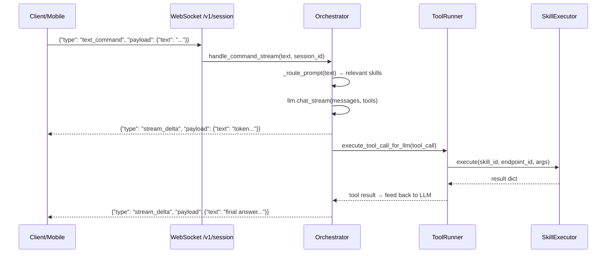
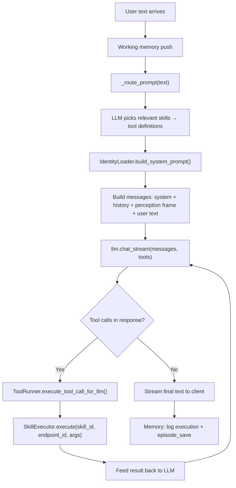
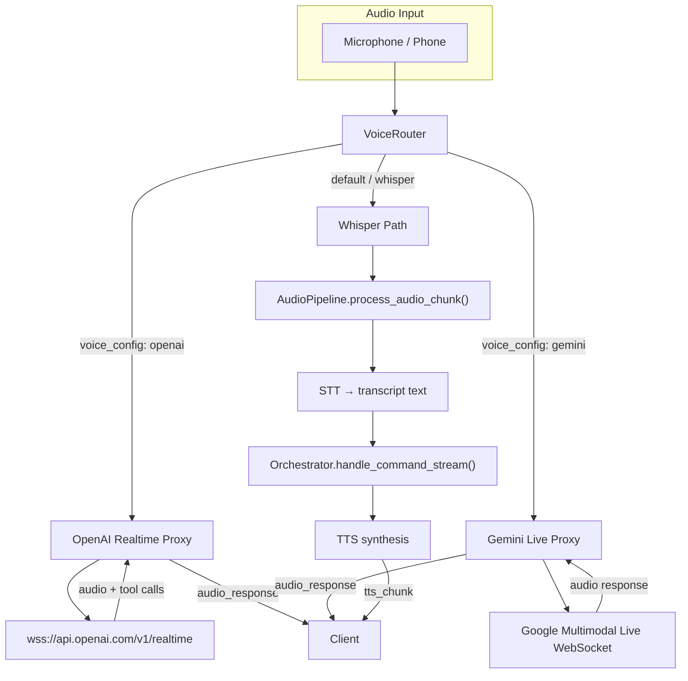
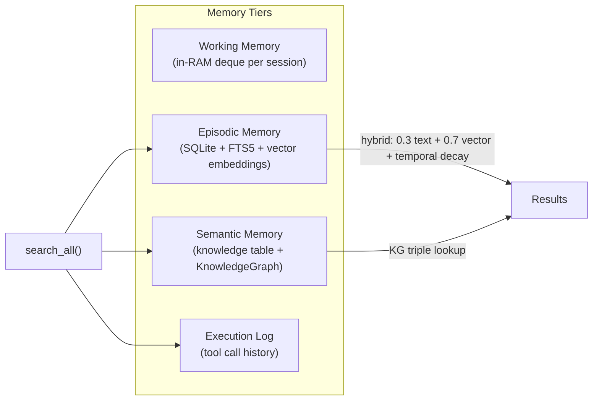
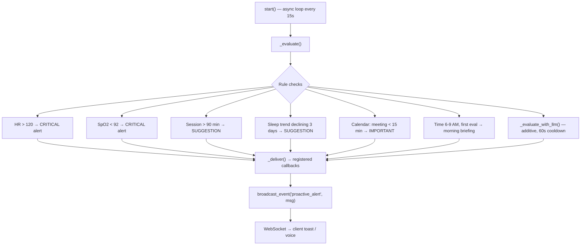

# FERAL Agent Handoff — Complete System State

> **Date**: April 2026
> **Repo**: `https://github.com/Spatial-AgenticOS/ASOS.git` (branch: `main`)
> **Local path**: `/Users/mahmoudomar/Desktop/thoera-mac/ASOS`

---

## 1. What FERAL Is

FERAL ("Unleashed AI") is an open-source, full-stack AI agent OS. It aims to be the **center of the user's digital life** — connecting to every device, understanding context, acting autonomously, and learning over time.

It competes directly with **OpenClaw** (open-source agent framework). Where OpenClaw is a polished npm ecosystem, FERAL is deeper in memory, voice, hardware, GenUI, and identity — but weaker in packaging, docs, and code hygiene.

**Stack**: Python 3.11+ backend (`feral-core`), React/Vite frontend (`feral-client`), Tauri desktop (`desktop/`), SDKs in Node + Python (`sdk/`), mobile bridges (`feral-nodes/`).

---

## 2. Repository Structure

```
ASOS/
├── feral-core/           # Python brain — THE core of the system
│   ├── agents/           # Orchestrator, ToolRunner, Scheduler, Learner, DigitalTwin, ProactiveEngine, LocalInference
│   ├── api/              # FastAPI server + routes (dashboard, config, skills, memory, routines, taskflows, llm, genui, mcp, channels, conversations, devices, timeline)
│   ├── channels/         # Telegram, Discord, Slack, WhatsApp, Push notifications
│   ├── cli/              # CLI entry point (`feral` command)
│   ├── config/           # ConfigLoader, runtime settings
│   ├── gateway/          # JSON-RPC gateway protocol
│   ├── genui/            # Server-driven UI generation engine
│   ├── hardware/         # HUP protocol, device registry, mesh, adapters (smart_home, robot_arm, wristband)
│   ├── identity/         # SOUL.md, USER.md, workspace loader
│   ├── integrations/     # Spotify, Notion, Home Assistant, Calendar, Email, Messaging, Health Platforms, OAuth, Webhooks
│   ├── mcp/              # Model Context Protocol client + server
│   ├── memory/           # 4-tier memory (episodic, semantic, working, knowledge graph) + vector search + P2P sync
│   ├── models/           # Pydantic models (protocol, skill manifests)
│   ├── perception/       # Screen capture, audio pipeline, sensor fusion, gesture detection, wake word, location/geofencing
│   ├── security/         # Vault, sandbox policy, exec approvals, WASM sandbox, Docker sandbox, dangerous tools, fetch guard
│   ├── skills/           # Skill registry, 17 JSON manifests, impl/ (browser_use, computer_use, web_search, etc.)
│   ├── tests/            # 35 test files, 70% coverage enforced in CI
│   ├── voice/            # OpenAI Realtime + Gemini Live proxies, TTS/STT, voice router
│   └── pyproject.toml    # Package: feral-ai 1.2.0
│
├── feral-client/         # React/Vite dashboard
│   └── src/
│       ├── components/   # TheOrb, AmbientStrip, CommandPalette, AppShell, SduiRenderer, etc.
│       └── pages/        # Dashboard, Settings, TaskFlows, Timeline, Ambient, SetupWizard
│
├── feral-nodes/          # Device bridges
│   ├── ios-bridge/       # Swift WebSocket + HealthKit bridge
│   ├── android-bridge/   # Kotlin WebSocket bridge
│   ├── phone-bridge/     # Python phone daemon
│   └── python-node-sdk/  # Hardware node template
│
├── desktop/              # Tauri desktop wrapper
├── sdk/node/             # @feral/sdk — TS SDK
├── sdk/python/           # feral-sdk — Python SDK
├── docs/                 # 13 markdown docs + Docusaurus site scaffold
├── scripts/              # install.sh, setup scripts
├── .github/workflows/    # ci.yml — pytest 70% + client build
└── docker-compose.yml    # Docker deployment
```

---

## 3. Git History (Most Recent First)

```
76a0e4b feat: FERAL Completeness Roadmap — 12 deliverables for center-of-life
9e1d5ac rebrand: THEORA/ASOS -> FERAL — AI off the leash
7f80a62 feat: UI overhaul — The Orb, ambient strip, command palette, rich messages, smart empty state
229d3fb Implement THEORA Shockwave Phase — demo mode, proactive intelligence, and recording-ready UI
c580d1c feat: THEORA Engineering Overhaul — 7 phases, 14 deliverables
c7ac82c feat: v1.2.0 — shell escaping fix, agent persistence, permissions, routines, UI polish
6f338d3 fix: make installs deterministic and close key platform gaps
...earlier commits...
```

---

## 4. What's Been Built (Completed)

### Phase 1: Engineering Overhaul (c580d1c)
- LLM provider abstraction (9 providers: OpenAI, Anthropic, Gemini, OpenRouter, Groq, Cerebras, LMStudio, Ollama, DeepSeek)
- Full skill registry + JSON manifest system
- Memory store (episodic + semantic + KG + vector + FTS5)
- Hardware mesh + HUP protocol
- Perception engine (screen, audio, sensor fusion)
- Security layers (vault, sandbox, approvals DB, WASM)

### Phase 2: Shockwave Phase (229d3fb)
- Demo mode for screen recordings
- Proactive intelligence engine (rule-based triggers)
- Recording-ready UI polish

### Phase 3: UI Overhaul (7f80a62)
- TheOrb — animated SVG identity with 6 states (idle, listening, thinking, speaking, alert, disconnected)
- Ambient Context Strip — live screen context, HR, session timer
- Rich Message Bubbles — Orb avatars, markdown, inline health pills
- Command Palette — Cmd+K overlay for quick actions
- Smart Empty State — personalized greeting, health summary, quick actions
- Full color cleanup (no more random purples/hex values)

### Phase 4: Rebrand to FERAL (9e1d5ac)
- Mass rename: THEORA/ASOS → FERAL across 323 files
- Directory renames: asos-core → feral-core, asos-client → feral-client, etc.
- New SVG logo (broken containment ring + claw marks)
- README rewritten as provocative manifesto
- LAUNCH.md with tweet threads, HN/Reddit posts, demo scripts

### Phase 5: Completeness Roadmap (76a0e4b) — 12 deliverables
| # | Feature | File(s) | Status |
|---|---------|---------|--------|
| 1 | Calendar Integration | `integrations/calendar.py` | Built — Google Calendar API v3 + ICS fallback |
| 2 | Email Integration | `integrations/email.py` | Built — Gmail API + IMAP + LLM summarization |
| 3 | Messaging Hub | `integrations/messaging.py` | Built — Telegram + Slack + Discord bridges |
| 4 | Real Autonomy Levels | `agents/tool_runner.py` (modified) | Built — strict/hybrid/loose + ApprovalManager wired |
| 5 | Push Notifications | `channels/push.py` | Built — FCM + APNs + SQLite device tokens |
| 6 | NL Automations | `agents/scheduler.py` (modified) | Built — NL-to-cron + recurring + list/delete |
| 7 | Health Platform Aggregation | `integrations/health_platforms.py` | Built — Whoop + Oura + unified aggregator |
| 8 | Location & Geofencing | `perception/location.py` | Built — haversine + SQLite fences + enter/exit |
| 9 | Proactive Coaching | `agents/proactive_engine.py` (modified) | Built — sleep trends + productivity + meeting prep + LLM eval |
| 10 | Offline LLM | `agents/local_inference.py` (modified) | Built — OllamaEngine + auto_setup_offline |
| 11 | Visual Timeline | `feral-client/src/pages/Timeline.jsx` + `api/routes/timeline.py` | Built — chronological view with filters |
| 12 | Ambient Mode | `feral-client/src/pages/Ambient.jsx` | Built — full-viewport always-on dashboard |
| 13 | Digital Twin | `agents/digital_twin.py` | Built — ask-as-user from memory + identity |

---

## 5. What's GENUINELY Strong (FERAL > OpenClaw)

| Dimension | Why FERAL Wins |
|-----------|---------------|
| **Memory** | 4-tier (episodic + semantic + KG + working) + FTS5 + vector search + P2P sync. OpenClaw has pluggable extensions but no default depth. |
| **GenUI/SDUI** | Real server-driven UI generation engine + provider system. OpenClaw has Canvas/A2UI but less dynamic. |
| **Identity/Personality** | Structured USER.md/SOUL.md/IDENTITY with learning loop. OpenClaw uses workspace files. |
| **Self-Learning** | Auto-detect knowledge triples + skill generation. OpenClaw is manual. |
| **Hardware Protocol** | Dedicated HUP + mesh + device registry + WebSocket adapters. OpenClaw has generic "nodes". |
| **Voice** | Core pipeline: OpenAI Realtime + Gemini Live + wake word + STT/TTS. OpenClaw is extension-based. |
| **TaskFlows** | Durable SQLite-backed state machines with multi-step types. OpenClaw is cron-only. |
| **Health/Wearables** | Whoop + Oura + BLE wristband + HealthKit bridge. No equivalent in OpenClaw. |
| **Proactive Intelligence** | Context-aware engine with rule + LLM hybrid, cooldowns, user preference learning. |

---

## 6. Honest Competitive Gap Analysis (FERAL < OpenClaw)

These are the areas where OpenClaw **genuinely beats** FERAL today:

### 6.1 Installation Story (CRITICAL)
- **OpenClaw**: `npm install -g @openclaw/cli` → works
- **FERAL**: `pip install feral-ai` → fragile, install.sh has 4 fallback paths
- **Issues**:
  - Stale `theora.egg-info/` and `theora_asos.egg-info/` in `feral-core/` (pre-rebrand artifacts)
  - `scripts/install.sh` tries local → git+https → PyPI → full clone
  - README says `pip install feral-ai` but it may not be published / up to date on PyPI
- **Fix needed**: Clean egg-info, test PyPI publish, one golden path

### 6.2 Plugin/Extension SDK (HIGH)
- **OpenClaw**: Full npm SDK, 20+ first-party extensions, `npx create-openclaw-extension`
- **FERAL**: `@feral/sdk` and `feral-sdk` exist but are 0.1.0. No publish, no registry, no `feral install <skill>` CLI
- **Issues**:
  - `sdk/node/` is a small TS client — not a full extension framework
  - `sdk/python/` has plugin.py but no discovery/install mechanism
  - `skills/manifests/*.json` (17 manifests) are hardcoded, not installable
  - `registry/server.py` exists but publish/search/install flow is incomplete
- **Fix needed**: Publish SDKs, add `feral install`, build extension template generator

### 6.3 Documentation (HIGH)
- **OpenClaw**: 411+ docs, hosted Docusaurus site, API reference, guides, tutorials
- **FERAL**: 13 markdown files in `docs/`, small Docusaurus scaffold in `docs/site/` with ~8 pages
- **Issues**:
  - No API reference generation (no Sphinx, no TypeDoc)
  - Docusaurus site has getting-started + SDK stubs + architecture — not comprehensive
  - No hosted documentation site
- **Fix needed**: Expand Docusaurus, add auto-generated API docs, deploy to GitHub Pages

### 6.4 Code Quality — Large File Problem (MEDIUM)
- **OpenClaw**: Clean monorepo, small focused modules
- **FERAL**: Several files are 500-1500+ lines
- **Biggest offenders**:
  - `memory/store.py` — 1543 lines
  - `agents/orchestrator.py` — 1427 lines
  - `api/server.py` — 1316 lines
  - `cli/main.py` — 834 lines
  - `skills/impl/browser_use.py` — 784 lines
  - `agents/llm_provider.py` — 695 lines
  - `api/state.py` — 659 lines
  - `genui/generator.py` — 598 lines
  - `channels/base.py` — 593 lines
- **Fix needed**: Split into submodules (e.g., `memory/` becomes `memory/episodic.py`, `memory/semantic.py`, `memory/kg.py`, `memory/vector.py`)

### 6.5 Frontend Test Coverage (MEDIUM)
- **CI status**: Python has 70% enforced (`pytest --cov-fail-under=70`). React client has **zero tests**.
- **Issues**:
  - `feral-client/` has no `*.test.js`, `*.test.jsx`, or `__tests__/`
  - CI only runs `npm run build` for client
- **Fix needed**: Add Vitest + React Testing Library, at least smoke tests for each page

### 6.6 Channel Parity (MEDIUM)
- **OpenClaw**: 10+ channels (WhatsApp, Telegram, Slack, Discord, Matrix, LINE, Teams, Zalo)
- **FERAL**: 4 real channels in `channels/base.py` (Telegram, Discord, Slack, WhatsApp) + messaging integrations
- **Missing platforms**: Matrix, LINE, Microsoft Teams, Zalo
- **Issues**:
  - Duplicate stacks: `channels/base.py` and `integrations/messaging.py` both implement Telegram/Slack/Discord
  - WhatsApp is webhook-only (no polling)
  - APNs in `push.py` lacks proper JWT signing
- **Fix needed**: Deduplicate, add Matrix + Teams at minimum, fix APNs

### 6.7 Security Narrative (LOW-MEDIUM)
- **OpenClaw**: Layered, per-session, well-documented
- **FERAL**: Actually has vault + sandbox_policy + exec_approvals + WASM + Docker sandboxes + dangerous_tools + fetch_guard — but **no single doc explaining the security model**
- **Issues**:
  - Policy enforcement coverage across every code path is unproven
  - No security architecture document
- **Fix needed**: Write `docs/SECURITY.md`, audit enforcement gaps

### 6.8 Native App Polish (LOW)
- **OpenClaw**: macOS, iOS, Android — store-ready apps
- **FERAL**: Tauri desktop shell, iOS/Android bridge SDKs, phone-bridge Python daemon
- **Issues**:
  - Bridge SDKs compile but aren't full apps
  - No TestFlight/Play Store presence
  - Desktop Tauri wrapper is minimal
- **Fix needed**: Polish desktop app, build minimal iOS/Android companion apps

---

## 7. What Was NOT in Any Plan (Discovered Gaps)

These issues were **never identified** in the original completeness roadmap:

1. **Stale packaging artifacts** — `theora.egg-info/` and `theora_asos.egg-info/` still in `feral-core/`
2. **Duplicate messaging stacks** — `channels/base.py` and `integrations/messaging.py` both implement Telegram/Slack/Discord. Maintenance hazard.
3. **APNs incomplete** — `channels/push.py` sends to `api.push.apple.com` but doesn't implement proper JWT token signing with the APNs auth key
4. **Zero frontend tests** — CI only builds the client, never tests it
5. **No API reference docs** — No Sphinx/TypeDoc auto-generation
6. **No hosted documentation** — Docusaurus exists but isn't deployed
7. **Install path fragility** — `scripts/install.sh` has 4 fallback paths, PyPI status unknown
8. **Missing chat platforms** — No Matrix, LINE, Teams, Zalo implementations
9. **File size debt** — 9 files over 500 lines, biggest at 1543
10. **No security architecture doc** — 7 security modules exist but no unified explanation
11. **Skill marketplace incomplete** — `registry/server.py` has structure but no publish/search/install CLI
12. **No contacts/people graph** — Plan mentioned it (item 16) but it wasn't in the TODO list
13. **No routine detection** — Plan mentioned it (item 9) but it wasn't in the TODO list
14. **Desktop app minimal** — Tauri shell exists but is barebones
15. **Bundled webui warning** — `cli/main.py` warns if dashboard not bundled (`make bundle-webui` required)

---

## 8. Execution Priority (What to Do Next)

### Wave 1: Credibility & Polish (make it real)
| Priority | Task | Impact | Effort |
|----------|------|--------|--------|
| P0 | Clean stale egg-info, fix PyPI publish, one-line install | Installation story | 1h |
| P0 | Deduplicate messaging (merge `integrations/messaging.py` into `channels/base.py` or vice versa) | Code quality | 2h |
| P0 | Fix APNs JWT signing in `channels/push.py` | Push notifications actually work | 1h |
| P1 | Split `memory/store.py` (1543 lines) → submodules | Code quality | 3h |
| P1 | Split `agents/orchestrator.py` (1427 lines) → submodules | Code quality | 3h |
| P1 | Split `api/server.py` (1316 lines) → route modules | Code quality | 2h |
| P1 | Add Vitest + minimal smoke tests for all 6 React pages | Frontend quality | 2h |

### Wave 2: Competitive Parity (match OpenClaw)
| Priority | Task | Impact | Effort |
|----------|------|--------|--------|
| P1 | Expand Docusaurus docs: API reference, guides, examples (target 50+ pages) | Documentation | 4h |
| P1 | Deploy docs to GitHub Pages via CI | Documentation | 1h |
| P1 | Add Matrix + Microsoft Teams channels | Channel parity | 3h |
| P2 | Publish `@feral/sdk` to npm, `feral-sdk` to PyPI | SDK story | 2h |
| P2 | Build `feral install <skill>` CLI + marketplace publish flow | Extension ecosystem | 4h |
| P2 | Write `docs/SECURITY.md` — unified security architecture doc | Security narrative | 2h |

### Wave 3: Moat Features (things OpenClaw can't match)
| Priority | Task | Impact | Effort |
|----------|------|--------|--------|
| P2 | Contacts/People Graph — auto-extraction from email/calendar/messages | Killer feature | 4h |
| P2 | Routine Detection — pattern mining on episodic memory | Eerily smart | 3h |
| P2 | Skill Marketplace UI — browse/install/rate in dashboard | Ecosystem | 4h |
| P3 | Desktop app polish — Tauri system tray, notifications, always-on | Native feel | 3h |
| P3 | Mobile companion apps — minimal iOS/Android with push + voice | Mobile presence | 8h |

---

## 9. Key Files Reference

### Core Brain
| File | Lines | Purpose |
|------|-------|---------|
| `agents/orchestrator.py` | 1427 | LLM agent loop, tool dispatch, multi-agent routing |
| `agents/tool_runner.py` | 552 | Safety classification, autonomy levels, anti-loop, subagents |
| `agents/scheduler.py` | ~600 | Cron jobs, NL automations, SQLite persistence |
| `agents/proactive_engine.py` | 415 | Context-aware triggers, coaching, LLM evaluation |
| `agents/digital_twin.py` | 232 | Answer-as-user from memory + identity |
| `agents/local_inference.py` | 536 | MLX + llama.cpp + Ollama engines |
| `agents/llm_provider.py` | 695 | 9-provider LLM abstraction |
| `agents/learner.py` | ~200 | Knowledge extraction, skill generation triggers |

### API & State
| File | Lines | Purpose |
|------|-------|---------|
| `api/server.py` | 1316 | FastAPI app, WebSocket handler, startup |
| `api/state.py` | 659 | Singleton brain state, all integration init |
| `api/routes/dashboard.py` | ~190 | Dashboard data + greeting endpoint |
| `api/routes/timeline.py` | 245 | Timeline, digital twin, automations, health, location, push, autonomy |

### Memory & Perception
| File | Lines | Purpose |
|------|-------|---------|
| `memory/store.py` | 1543 | Episodic, semantic, KG, vector search, FTS5 |
| `memory/ingest.py` | ~200 | Memory ingestion pipeline |
| `memory/sync.py` | ~300 | P2P sync with WAL |
| `perception/fusion.py` | ~200 | Sensor fusion engine |
| `perception/location.py` | 200 | GPS + geofencing |
| `perception/audio_pipeline.py` | ~300 | STT/TTS/VAD |
| `perception/wake_word.py` | ~150 | Wake word detection |

### Integrations
| File | Purpose |
|------|---------|
| `integrations/calendar.py` | Google Calendar + ICS |
| `integrations/email.py` | Gmail + IMAP |
| `integrations/messaging.py` | Telegram + Slack + Discord (integration-style) |
| `integrations/health_platforms.py` | Whoop + Oura aggregator |
| `integrations/spotify.py` | Spotify Web API |
| `integrations/home_assistant.py` | Home Assistant REST |
| `integrations/notion.py` | Notion API |
| `integrations/oauth_manager.py` | OAuth2 token management |

### Frontend
| File | Purpose |
|------|---------|
| `feral-client/src/App.jsx` | Main chat interface |
| `feral-client/src/pages/Dashboard.jsx` | System dashboard |
| `feral-client/src/pages/Timeline.jsx` | Chronological life view |
| `feral-client/src/pages/Ambient.jsx` | Always-on display mode |
| `feral-client/src/pages/Settings.jsx` | Configuration |
| `feral-client/src/pages/TaskFlows.jsx` | Automation flows |
| `feral-client/src/components/TheOrb.jsx` | Animated identity visual |
| `feral-client/src/components/AppShell.jsx` | Layout + sidebar nav |
| `feral-client/src/components/CommandPalette.jsx` | Cmd+K overlay |

### Security
| File | Purpose |
|------|---------|
| `security/vault.py` | Credential storage + permission tiers |
| `security/sandbox_policy.py` | Declarative network/fs/exec policy |
| `security/exec_approvals.py` | SQLite approval grants (session + permanent) |
| `security/wasm_sandbox.py` | WASM sandboxed skill execution |
| `security/docker_sandbox.py` | Docker container sandboxing |
| `security/dangerous_tools.py` | Danger pattern matching |
| `security/fetch_guard.py` | URL/network request filtering |

---

## 10. Environment & Config

- **Python**: 3.11+ required
- **Node**: 18+ for client build
- **Key env vars**: `OPENAI_API_KEY`, `ANTHROPIC_API_KEY`, `FERAL_AUTONOMY` (strict/hybrid/loose), `FERAL_TELEGRAM_BOT_TOKEN`, `FERAL_SLACK_BOT_TOKEN`, `FERAL_DISCORD_BOT_TOKEN`, `FERAL_WHOOP_TOKEN`, `FERAL_OURA_TOKEN`, `FERAL_FIREBASE_CREDENTIALS`, `FERAL_APNS_KEY_PATH`, `FERAL_CALENDAR_ICS`, `FERAL_EMAIL_IMAP_HOST`, `FERAL_OLLAMA_URL`
- **Data home**: `~/.feral/` (SQLite DBs, models, config)
- **CI**: `.github/workflows/ci.yml` — pytest 70% coverage + client build

---

## 11. Runtime Architecture Deep Dive

This section traces the 8 critical data flows a new agent must understand before modifying anything.

### 11.1 WebSocket Protocol



**Entry point**: `api/server.py` `client_session()` at line ~699 — `@app.websocket("/v1/session")`

**Wire format**: Every message is a `FeralMessage` (defined in `models/protocol.py`):
```
{msg_id, session_id, timestamp_ms, hop: "client"|"brain"|"daemon"|"skill", type, payload}
```

**Client-to-brain message types**:
| `type` | Handler |
|--------|---------|
| `text_command` | `orchestrator.handle_command_stream` |
| `voice_config` | `voice_router.set_session_voice_mode` → start OpenAI or Gemini realtime session |
| `audio_chunk` | Route to Gemini proxy or `voice_router.handle_audio_from_client` |
| `ui_event` | `orchestrator.handle_ui_event` |
| `device_register` | Updates `state.devices` |
| `vision_frame` | Stored in `VisionBuffer` |
| `biometric` | Routes to perception |

**Brain-to-client message types**: `text_response`, `stream_delta`, `transcript`, `tts_chunk`, `audio_response`, `voice_config_ack`, `skill_proposal`, `sdui_update`, `proactive_alert`, `ambient_context`

### 11.2 Orchestrator Agent Loop

**Entry**: `agents/orchestrator.py` `handle_command_stream()` at line ~439



**Key env vars**:
- `FERAL_STREAMING` (default true) — streaming vs single-shot
- `FERAL_MULTI_AGENT` — enables multi-agent routing
- `FERAL_MAX_ITERATIONS` — max tool-call loops before break
- `FERAL_VISION_ENABLED` — include screen frame in perception

**Multi-agent path**: If enabled, `MultiAgentOrchestrator.run()` splits into parallel skill-specific agents.

### 11.3 Tool Execution Chain

Example: user says "check my calendar"

```
User: "check my calendar"
  → orchestrator._route_prompt("check my calendar")
    → LLM router returns ["calendar_google"]
  → skills.get_tools_for_skills(["calendar_google"])
    → [{name: "calendar_google__upcoming_events", parameters: {...}}, ...]
  → LLM emits tool_call: {name: "calendar_google__upcoming_events", arguments: {days_ahead: 7}}
  → ToolRunner.execute_tool_call_for_llm()
    → parse name as "calendar_google" + "upcoming_events"
    → enforce_safety("calendar_google__upcoming_events", args) → checks autonomy mode
    → SkillExecutor.execute("calendar_google", "upcoming_events", args)
      → checks get_implementation("calendar_google")
      → if registered: CalendarIntegration.execute("upcoming_events", args)
      → if NOT registered: falls back to manifest HTTP/OAuth path
  → result dict returned to LLM for summarization
```

**Skill ID convention**: Tool names in LLM calls are `{skill_id}__{endpoint_id}` (double underscore separator). The `ToolRunner` splits on `__` at line ~274.

**Registration matters**: `register_instance(skill_id, integration_object)` must use the EXACT skill_id from the JSON manifest. Mismatches cause the executor to miss the native implementation and fall back to raw HTTP.

### 11.4 Identity System

**Files on disk** (all under `~/.feral/`):
| File | Purpose | Loader |
|------|---------|--------|
| `IDENTITY.yaml` | Name, tagline, version, greeting style | Both loaders |
| `SOUL.md` | Free-form personality (tone, style, boundaries) | Both loaders |
| `USER.md` | User profile (preferences, context) | Both loaders |
| `MEMORY.md` | Accumulated facts the system should always remember | Both loaders |
| `TOOLS.md` | Known tool preferences | IdentityWorkspace only |

**Two parallel loaders** (historical artifact):
1. `identity/workspace.py` `IdentityWorkspace` — used by voice personality and Gemini system prompt
2. `agents/identity_loader.py` `IdentityLoader` — used by the orchestrator for LLM system prompt

**System prompt assembly** (`IdentityLoader.build_system_prompt`):
```
Hard-coded rules (safety, formatting)
  + Identity text (SOUL + USER + MEMORY merged)
  + Perception frame context (screen, audio, sensors)
  + Memory context (build_context_for_llm with recent episodes)
  + Available skill names
  + Connected hardware nodes
```

### 11.5 Voice Pipeline (Three Paths)



- **OpenAI Realtime** (`voice/realtime_proxy.py`): Full-duplex WebSocket. Audio in + audio out + inline tool calls. `RealtimeSession._handle_tool_call` routes to `SkillExecutor.execute`.
- **Gemini Live** (`voice/gemini_realtime.py`): Same concept, Google's Multimodal Live API. Bypasses OpenAI path entirely when active.
- **Whisper path** (`voice/router.py` `_handle_whisper_path`): STT → text → orchestrator → TTS. Higher latency but works with any LLM provider.

**Wake word**: Optional gate before any audio path. Config via `FERAL_WAKE_WORD` env var. Implementation: `perception/wake_word.py`.

### 11.6 Memory System (4 Tiers)



**Key methods**:
- `episode_save(content, metadata)` — saves + queues for embedding
- `episode_search_hybrid(query, limit)` — FTS + vector cosine + temporal decay (TEXT_WEIGHT=0.3, VECTOR_WEIGHT=0.7)
- `search_all(query)` — merges episodes, notes, knowledge, KG entities, sorted by score
- `log_execution(tool_name, args, result)` — audit trail
- `working_push(session_id, text)` / `working_get(session_id)` — short-term context

**DB**: SQLite at `~/.feral/memory.db`

### 11.7 Proactive Engine



**Cooldown**: Each trigger type has `TriggerState` with `cooldown_s` (default 300s) and tracks `dismiss_count` for preference learning.

**PerceptionFrame** (from `perception/fusion.py`): Dataclass with `audio`, `vision`, `sensors` (HR, SpO2, temp), `gesture`, `nodes`, `screen_description`.

### 11.8 GenUI / Server-Driven UI

**Flow**: `GenUIEngine.generate_from_prompt(prompt, context_data)` → LLM with `GENUI_SYSTEM_PROMPT` → parse JSON SDUI tree → deliver to client as `sdui_update` message.

**ServiceProvider system**: Reusable branded component templates. `register_component()` / `register_surface()` → `render()` hydrates templates with data → cached under `~/.feral/genui_surfaces/`.

**Client rendering**: `feral-client/src/components/SduiRenderer.jsx` — recursive component tree renderer. Supports: MarkdownView, ChartView, TableView, FormView, ImageView, TerminalView, AlertView.

### 11.9 Known Wiring Bugs (Must Fix)

These are real bugs where code exists but is not connected:

1. **ProactiveEngine missing calendar + health**: `api/state.py` line ~390 creates `ProactiveEngine` but does NOT pass `calendar=self.calendar` or `health_aggregator=self.health_aggregator`. The engine has `_calendar` and `_health` params and uses them for meeting prep and sleep trend checks — but they're `None` at runtime. **Fix**: add the kwargs to the constructor call.

2. **Skill registration ID mismatch**: `register_instance("calendar", self.calendar)` uses ID `"calendar"` but the manifest `skills/manifests/calendar.json` defines `"skill_id": "calendar_google"`. When the LLM calls `calendar_google__upcoming_events`, the executor looks for implementation with key `"calendar_google"` and finds nothing. Same issue with messaging: registered as `"messaging"` but manifest says `"messaging_sms"`. **Fix**: use exact manifest IDs.

3. **APNs JWT signing incomplete**: `channels/push.py` `_send_apns()` sends to `api.push.apple.com` but does not implement JWT token generation with the APNs auth key. Production APNs requires a signed JWT in the Authorization header using ES256. **Fix**: implement JWT signing with `cryptography` or `PyJWT`.

---

## 12. The "Center of Your Life" Vision

This is the core product thesis. FERAL aims to be a single AI brain at the center of everything:

```
                        ┌─────────────┐
                        │   CALENDAR   │
                        │  Email       │
                   ┌────┤  Messaging   ├────┐
                   │    └─────────────┘    │
            ┌──────┴──────┐         ┌──────┴──────┐
            │  SMART HOME  │         │   HEALTH     │
            │  Lights      │         │  Whoop       │
            │  Thermostat  │         │  Oura Ring   │
            │  Appliances  │         │  Wristband   │
            └──────┬──────┘         └──────┬──────┘
                   │    ┌─────────────┐    │
                   │    │             │    │
                   └────┤ FERAL BRAIN ├────┘
                   ┌────┤  Memory     ├────┐
                   │    │  Identity   │    │
                   │    │  Autonomy   │    │
            ┌──────┴──────┐         ┌──────┴──────┐
            │  COMPUTER    │         │    PHONE     │
            │  Screen      │         │  Push notifs │
            │  Browser     │         │  Location    │
            │  Files       │         │  Camera      │
            └──────┬──────┘         └──────┬──────┘
                   │    ┌─────────────┐    │
                   └────┤   VOICE      ├────┘
                        │  Wake word   │
                        │  Realtime    │
                        └─────────────┘
```

**What's built**: All integration code exists. Calendar, email, messaging, health platforms, location, push notifications, smart home, screen capture, browser use, voice pipeline, memory, identity, autonomy levels, proactive coaching, GenUI, digital twin, ambient mode, timeline view.

**What's wired**: Most integrations are initialized in `state.py` and registered as skills. The proactive engine runs its eval loop. Voice pipeline works end-to-end.

**What's broken wiring** (see 11.9): ProactiveEngine doesn't receive calendar/health objects. Skill registration IDs don't match manifests. APNs auth incomplete. Phone bridge GPS returns fake data.

---

## 13. Instructions for New Agent

1. **Read this file first.** It is the single source of truth.
2. **Run `ls -la` at the repo root** to orient yourself, then check `git log --oneline -10` for recent changes.
3. **Before editing any file**, read it first with the Read tool.
4. **After every meaningful change set**, commit and push to `origin main`.
5. **Check the "Execution Priority" table in Section 8** — that's your ordered task list.
6. **Fix the 3 wiring bugs in Section 11.9 FIRST** — they're blocking features that are already built.
7. **Key patterns to follow**:
   - Python integrations: match `integrations/spotify.py` pattern (class, `__init__(oauth_manager)`, `execute()` dispatch)
   - API routes: match `api/routes/dashboard.py` pattern (FastAPI router, import state)
   - React pages: match `pages/Dashboard.jsx` pattern (functional component, `API_BASE` config, `feral-*` CSS tokens)
   - Tests: match `tests/test_safety.py` pattern (pytest, async where needed)
8. **Don't duplicate work.** The 12 completeness roadmap features are DONE. Focus on the gaps in Sections 6 and 7.
9. **The comparison table with OpenClaw is the north star.** Every change should flip a row from "OpenClaw wins" to "Tie" or "FERAL wins."
10. **Understand the data flows in Section 11 before modifying the orchestrator, voice, memory, or proactive engine.** These are tightly coupled systems — a change in one affects the others.
