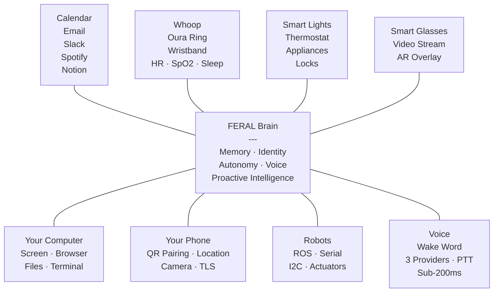
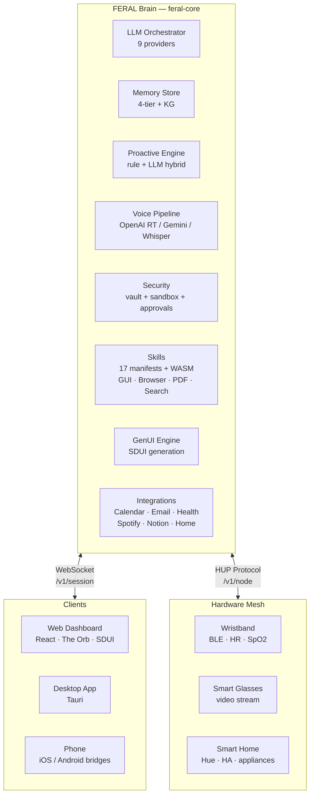

<p align="center">
  
</p>

<h3 align="center">One brain. Every device. Your entire life.</h3>
<p align="center"><em>The open-source AI that connects to everything you own — wristband, glasses, home, computer, phone, robots — learns your baseline, and runs things the way you would. Locally. Privately. No cloud.</em></p>

<p align="center">
  <a href="#the-idea">The Idea</a> &nbsp;·&nbsp;
  <a href="#what-it-does">What It Does</a> &nbsp;·&nbsp;
  <a href="#get-started">Get Started</a> &nbsp;·&nbsp;
  <a href="#demos">Demos</a> &nbsp;·&nbsp;
  <a href="#architecture">Architecture</a> &nbsp;·&nbsp;
  <a href="#contributing">Contributing</a>
</p>

<p align="center">
  
  <a href="https://github.com/FERAL-AI/FERAL-AI/stargazers"></a>
  <a href="https://github.com/FERAL-AI/FERAL-AI/commits/main"></a>
  
  
  
</p>

---

> **OpenAI built a chatbot. Apple built Siri. Google built an ad machine. Meta open-sourced some weights and called it a day.**
>
> None of them built an AI that connects to your wristband, your smart glasses, your thermostat, your robot arm, your computer, and your phone — learns your routines, builds your baseline, and proactively manages your physical and digital world. All locally. All privately.
>
> **We did.** And we open-sourced all of it.

---

## Feature Maturity

> **Stable** means all 5 criteria are met: ≥1 integration test, structured logging (`feral.{subsystem}.{name}`), documented env vars + settings, graceful error handling, and a troubleshooting guide in `docs/mintlify/`. **1344 tests pass** on every commit. See [docs/mintlify/guides/](docs/mintlify/guides/) for per-feature troubleshooting.

| Feature | Status | Details |
|---------|--------|---------|
| **Chat + LLM Orchestration** | Stable | 10 providers, failover, streaming, tool calling |
| **Memory (4-tier + P2P sync)** | Stable | Notes, episodic, knowledge graph, CRDT sync |
| **Skills + Tool Execution** | Stable | 19 skills, multi-runtime executor, blind vault |
| **CLI + Setup Wizard** | Stable | `feral start/serve/doctor/setup`, interactive wizard with key validation |
| **Web Dashboard** | Stable | Chat, SDUI, settings, dashboard, timeline |
| **Ambient** | Stable | 3 modes (Briefing/Desk/Wind-Down), somatic wallpaper, wake-word, auto-switch |
| **Glass Brain Visualization** | Stable | Three.js, real-time cognition, channel/device/voice satellites, click-to-inspect |
| **Security + Autonomy** | Stable | Safety classification, approval gates, Docker sandbox, auto-generated API key |
| **Voice (OpenAI/Gemini/Local)** | Stable | Realtime proxies, wake word, push-to-talk, reconnect, per-chunk latency logs |
| **Browser Automation** | Stable | CDP + Playwright, cookies, network interception, iframes |
| **GUI Computer Use** | Stable | Anthropic-style, Retina DPI (2x/3x), rate-limited (10/s default), cross-platform |
| **PDF Intelligence** | Stable | Tables, images, OCR, metadata, layout preservation, MAX_PAGES guard |
| **Search (7 providers)** | Stable | Tavily, Brave, DDG, Exa, SearXNG, Perplexity, Google CSE; provider_used tracking |
| **Channels (Telegram/Discord/Slack/WhatsApp)** | Stable | Bidirectional, webhook support, rate-limit-aware retry (429/503) |
| **Cron + Scheduling** | Stable | NL parsing, timezone, priorities, cron macros, missed-job catch-up, file-locked DB |
| **Proactive Engine** | Stable | Health alerts, smart home automation, LLM-hybrid, per-trigger counters |
| **Smart Home (Hue + HA)** | Stable | Real Philips Hue API (meethue.com + mDNS fallback), HA REST/Supervisor |
| **Browser Extension** | Stable | Chrome/Firefox, page context, chat sidebar, voice, configurable brain URL + auth |
| **MQTT Bridge** | Stable | TLS + mTLS, username/password, persistent client, IoT auto-discovery |
| **Home Assistant Add-on** | Stable | Pinned base image, CI build, UPGRADE.md, 2000+ device types |
| **Desktop Tray App** | Stable | Tauri, per-OS CI (mac/linux/win), first-run setup wizard, global hotkey |
| **Webhook Receiver** | Stable | CRUD API, HMAC verification, action mapping |
| **Email Watcher** | Stable | IMAP IDLE + XOAUTH2, polling fallback, VIP filtering, MIME parser |
| **iOS App** | Stable | HealthKit, QR pairing, TLS pinning (FERAL_BRAIN_CERT_HASH), XCTest suite |
| **Android App** | Stable | Health Connect, QR pairing, foreground service, Espresso tests |
| **Hardware Mesh (HUP)** | Stable | Typed devices, command contract, BLE, W300 glasses, approval gate soak-tested |
| **Somatic Context Layer** | Stable | 12D body vector, cognitive load, behavioral policies, privacy-audited logs |
| **Tool Genesis** | Stable | AST import allowlist, requires_approval gate, Docker sandbox execution |
| **Agent Mitosis** | Stable | Self-spawning specialists, orchestrator routing, satisfaction feedback |
| **Intent Compiler** | Stable | Goal → actions with skill validation, timezone-aware today(), JSON-parse fallback |
| **Digital Twin** | Stable | Ask-as-user, predict preferences, daily reflection, ethical bounds documented |
| **A2UI Protocol** | Stable | Versioned (v1.0) wire format, cross-client contract tests, schema doc |
| **Federated Memory Sync** | Stable | CRDT + HLC, mTLS, mDNS + static peer fallback, 100-op fuzz tests |
| **Observability** | Stable | OpenTelemetry + Prometheus `/metrics`, per-subsystem counters + latency histograms |
| **Video Generation** | Planned | — |
| **Music Generation** | Planned | — |
| **Native macOS App** | Planned | — |

---

## The Idea

FERAL is **one local brain for every device you own**. It connects to your wristband, your smart glasses, your home, your computer, your phone, your robots — every device, every app, every sensor. It learns your daily baseline across all of them. And it proactively manages hardware, software, health data, and your environment through natural language and intent.



It talks to **every device** — wristbands, smart glasses, home appliances, robots, your computer, your phone. It integrates with **every app** — calendar, email, Telegram, Slack, Spotify, Notion. It builds a **living model** of your routines and health through persistent memory. And it acts based on the **level of autonomy you choose**:

| Mode | Behavior |
|------|----------|
| **Strict** | Every action requires your explicit approval via a confirmation card |
| **Hybrid** | Safe actions auto-execute; risky ones ask first |
| **Loose** | Full autopilot — FERAL acts, you review the log |

---

## What It Does

<table>
<tr>
<td width="50%" valign="top">

### 🧠 Persistent Memory
Episodic recall, knowledge graph, semantic search, notes wiki. Four memory tiers that remember your entire life — not just the current session.

### 🎙️ Sub-200ms Voice
Wake word detection, OpenAI Realtime + Gemini Live streaming, interrupt-and-resume. Push-to-talk and toggle modes. Provider selection in Settings. Auto-reconnection with exponential backoff.

### 🏠 Hardware Mesh
Direct Bluetooth/local control of lights, sensors, wristbands, smart glasses, robots. No cloud roundtrip. 12+ device types.

### 💊 Live Health Data
Heart rate, SpO2, skin temp from your wristband in real-time. Whoop and Oura Ring integration. Sleep and recovery trends.

</td>
<td width="50%" valign="top">

### 🤖 Proactive Intelligence
FERAL doesn't wait for commands. It watches ambient context — screen, health, calendar — and speaks up when it has something valuable to say.

### 🖥️ Computer Use
Anthropic-style GUI control (screenshot, click, type, scroll, window management) with Retina DPI auto-detection. Coding tools for file and shell operations. Browser automation with session persistence, network monitoring, and iframe support.

### 🎨 Server-Driven UI (GenUI)
The brain generates UI dynamically — charts, forms, cards, alerts — and pushes them to whatever screen you're looking at.

### 🪞 Digital Twin
"What would I think about this?" — FERAL builds a model of your preferences, decisions, and reasoning from your history. Ask your digital twin anything.

</td>
</tr>
</table>

<table>
<tr>
<td width="50%" valign="top">

### 📅 Calendar + Email + Messaging
Google Calendar, Gmail, Telegram, Slack, Discord — all integrated. Morning briefings that are real, not simulated.

### 🔒 Three Autonomy Levels
Strict, hybrid, or loose. Real enforcement via ApprovalManager + safety classification. Not just a config flag.

</td>
<td width="50%" valign="top">

### 📍 Location-Aware Triggers
GPS geofencing: "When I arrive at the office, brief me on my day." Enter/exit detection with configurable actions.

### 🌙 Ambient Mode
Always-on full-screen dashboard — next meeting, heart rate, active tasks, weather, last memory. Your AI life at a glance.

</td>
</tr>
</table>

<table>
<tr>
<td width="50%" valign="top">

### 🔍 Search (7 Providers)
Tavily, Brave, DuckDuckGo, Exa, SearXNG, Perplexity, Google CSE — with automatic failover, 5-minute result caching, and cross-provider deduplication.

### 📄 PDF Intelligence
Table extraction, image extraction with base64, OCR fallback, metadata parsing, and layout-preserving structured extraction. Reads any PDF, not just text-based ones.

</td>
<td width="50%" valign="top">

### 📱 Mobile Bridges (iOS + Android)
QR code pairing for instant setup. GPS location forwarding to the brain. TLS (wss://) transport. iOS offline sensor queue. Android camera capture via CameraX. Wake word detection on-device.

### 🧪 Code Interpreter
Docker-first sandboxed execution: --network=none, --memory=512m, --cpus=1, --read-only. Falls back to host with resource limits when Docker is unavailable.

</td>
</tr>
</table>

### Universal Connectivity

| Surface | What It Does |
|---------|-------------|
| **Browser Extension** | FERAL in your browser — reads pages, chat sidebar, right-click actions, voice |
| **MQTT Bridge** | Connect to any IoT device — smart plugs, sensors, ESP32, Zigbee2MQTT |
| **Home Assistant** | Run as HA add-on — instant access to 2000+ device types |
| **Desktop Tray** | Always-on access — Cmd+Shift+F for Spotlight-style commands |
| **Webhooks** | Any service can trigger FERAL — GitHub, Stripe, IFTTT, Zapier |
| **Email Watcher** | FERAL monitors your inbox — summarize, reply, extract action items |
| **iOS App** | HealthKit relay, chat, voice, camera, QR pairing |
| **Android App** | Health Connect relay, chat, voice, camera, foreground service |

---

## Comparison

Every claim below links to the file that implements it, so you can read the
code instead of our marketing copy.

| Dimension | Big AI (OpenAI, Apple, Google) | OpenClaw | **FERAL — shipped file paths** |
|---|---|---|---|
| Dynamic skill creation at runtime | No | No | **[`feral-core/agents/tool_genesis.py`](feral-core/agents/tool_genesis.py) drafts + sandboxes + promotes new tools; wired into [`agents/orchestrator.py::_on_capability_gap`](feral-core/agents/orchestrator.py); [`feral-core/skills/impl/workspace_scripts.py`](feral-core/skills/impl/workspace_scripts.py) is the never-say-no fallback.** |
| Community marketplace (software + hardware) | No | No | **[`feral-registry/`](feral-registry/) — FastAPI service with Ed25519-signed bundles, GitHub OAuth, `POST /items` publish and `feral install` round-trip. Hardware side: [`feral-nodes/HUP_SPEC.md`](feral-nodes/HUP_SPEC.md) defines the node wire protocol; daemons listed in the registry under `type=node`.** |
| Never-stall retry mechanics | No | No | **[`feral-core/agents/refusal_handler.py`](feral-core/agents/refusal_handler.py) handles reasoning-only, empty-response, and ack-execution patterns; retry hooks live in [`feral-core/agents/orchestrator.py`](feral-core/agents/orchestrator.py) and inject prompt additions without mutating persisted history.** |
| Self-introspection | No | No | **[`feral-core/skills/impl/self_introspection.py`](feral-core/skills/impl/self_introspection.py) exposes the live tool catalog at tool-call time; [`feral-core/agents/self_model.py`](feral-core/agents/self_model.py) builds the unified chat+voice `Runtime:` line and prose `## Tooling` section inserted into every system prompt.** |
| Autonomy tiers (strict / hybrid / loose) | No | No | **Behavior per tier documented in [`docs/AGENT_CAPABILITIES.md`](docs/AGENT_CAPABILITIES.md); enforced in [`feral-core/agents/orchestrator.py`](feral-core/agents/orchestrator.py) and gated by [`feral-core/security/`](feral-core/security/) (approval manager + safety classifier).** |
| Local-first / privacy | Cloud roundtrip | Local-first for CLI | **Config + vault on disk only: [`feral-core/config/loader.py`](feral-core/config/loader.py), [`feral-core/config/runtime.py`](feral-core/config/runtime.py), [`feral-core/security/vault.py`](feral-core/security/vault.py). No telemetry by default; default bind is `127.0.0.1`.** |
| Hardware-aware perception | No | Generic nodes | **[`feral-core/perception/fusion.py`](feral-core/perception/fusion.py) merges somatic, screen, audio, and location streams into a single `PerceptionFrame`; BLE wristband adapter at [`feral-core/hardware/adapters/wristband.py`](feral-core/hardware/adapters/wristband.py) feeds biometrics straight in.** |
| Messaging channels | API-only | `message` tool | **Unified `messaging_channels` skill with `@username`→chat_id resolve, live status in UI, and never-refuse execution bias (see [`feral-core/channels/`](feral-core/channels/) + [`feral-core/skills/impl/messaging_channels.py`](feral-core/skills/impl/messaging_channels.py)).** |
| Memory | Forgets between sessions | Plugin-based | **4-tier + knowledge graph + CRDT P2P sync under [`feral-core/memory/`](feral-core/memory/).** |
| Voice | 2s latency, cloud-only | Extension-based | **Sub-200ms, wake word, 3 providers in [`feral-core/voice/`](feral-core/voice/) (OpenAI Realtime, Gemini Live, local Whisper+Piper).** |
| GenUI | No | Canvas / A2UI | **Full SDUI generation engine ([`feral-core/genui/`](feral-core/genui/)) that renders on iOS, Android and web.** |
| Glass-brain visualization | No | No | **Live WebGL visualization of active sessions, skills, memory writes — client in [`feral-client/`](feral-client/), brain events in [`feral-core/observability/`](feral-core/observability/).** |
| Setup | Each app separately | `claude init` | **One `feral start` → wizard in [`feral-core/cli/setup_wizard.py`](feral-core/cli/setup_wizard.py) provisions LLM, channels, voice, memory, mDNS, apps — streams a live boot report.** |
| Open source | Weights only | Yes | **Yes — brain, client, mobile, SDK, desktop, nodes (everything under [`ASOS/`](./)).** |

**What FERAL copied from OpenClaw (and improved):**
- OpenClaw's unified `message` tool and "never refuse, call the tool" system-prompt pattern → FERAL's `messaging_channels__send` with planning-only retry, live channel roster in the prompt, and post-send confirmation suppression so the agent doesn't narrate twice.
- OpenClaw's `@username` → chat_id auto-resolution → FERAL's `resolve_username` with per-channel caching, implemented for Telegram and extensible to Slack/Discord.

**What FERAL adds that OpenClaw doesn't:**
- A ring of physical perception (wristband biometrics, glasses, phone GPS/camera/mic) feeding a single `PerceptionFrame`.
- 4-tier memory with P2P sync across your own devices (no central server).
- A Glass Brain — a live 3D visualization of active sessions, skills firing, and memory writes.
- Multi-modal voice providers with sub-200ms wake-word path.
- A generative UI engine (SDUI) the agent can emit to any client.

---

## Get Started

**One-line install** (macOS / Linux):

```bash
curl -sSL https://raw.githubusercontent.com/FERAL-AI/FERAL-AI/main/scripts/install.sh | bash
```

The installer detects Python 3.11+, creates an isolated venv at `~/.feral-env`, installs `feral-ai[all]`, and prints the activation command. Then:

```bash
source ~/.feral-env/bin/activate
feral start
```

That's it. The Brain starts on `http://localhost:9090` with the web dashboard bundled, the setup wizard runs on first launch, and your browser opens automatically.

**Alternative: pip**

```bash
pip install "feral-ai[all]"
feral start
```

### What Happens
1. `feral start` detects first run → launches the setup wizard
2. You pick an LLM provider (OpenAI, Anthropic, Gemini, Ollama, LM Studio, etc.) and enter your API key
3. FERAL auto-generates a secure API key at `~/.feral/api_key` (shown once in the console)
4. The Brain starts on port 9090, the web dashboard opens, your browser navigates to it

No API key required for local models (Ollama auto-detected on `localhost:11434`, LM Studio on `localhost:1234`).

### Development Mode
If you're developing FERAL itself:
```bash
git clone https://github.com/FERAL-AI/FERAL-AI.git
cd FERAL-AI
make dev           # installs both brain + client
feral serve        # brain on :9090 (headless)
cd feral-client && npm run dev  # Vite on :5173
```

---

## Connect Your First Device

### iOS / Android
Download the FERAL Node app, scan the QR code shown in Settings, and grant HealthKit/Health Connect permissions.

### Wristband (BLE)
Run the hardware daemon on your Mac/Linux host:
```bash
python -m feral_nodes.hardware_daemon --brain ws://localhost:9090 --api-key $FERAL_API_KEY
```

### Smart Home (Philips Hue)
Press the button on your Hue bridge, then open Settings > Devices > Add Hue Bridge.

---

## Architecture



**Brain** (`feral-core`): Python. FastAPI + WebSocket. LLM orchestration, tool execution, memory, proactive intelligence, voice pipeline, hardware mesh coordination.

**Client** (`feral-client`): React. Server-Driven UI. The Orb. Command palette. Ambient context strip. Timeline view. Pure renderer — the brain decides what to show.

**Nodes** (`feral-nodes`): Hardware bridges that connect physical devices to the brain via the mesh protocol. Wristband streams biometrics. Glasses stream video. Smart home controls actuators. iOS and Android bridges with QR pairing, location forwarding, and TLS transport.

---

## The Stack

```
feral/
├── feral-core/          # Brain: Python, FastAPI, LLM orchestration
│   ├── agents/          # Orchestrator, proactive engine, digital twin, scheduler
│   ├── memory/          # Episodic, semantic, knowledge graph, vector search, sync
│   ├── voice/           # Wake word, OpenAI Realtime, Gemini Live, Whisper path
│   ├── hardware/        # HUP mesh protocol, device adapters
│   ├── integrations/    # Calendar, email, health, Spotify, Notion, Home Assistant
│   ├── skills/          # Plugin system, 17 manifests, WASM sandbox, marketplace
│   ├── perception/      # Screen capture, audio pipeline, sensor fusion, geofencing
│   ├── channels/        # Telegram, Discord, Slack, WhatsApp, push notifications
│   ├── genui/           # Server-driven UI generation + provider system
│   └── security/        # Vault, sandbox, permissions, approval gates
├── feral-client/        # Web UI: React, The Orb, SDUI renderer, Timeline, Ambient
├── feral-nodes/         # Hardware bridges: iOS, Android, phone, Python SDK
├── desktop/             # Desktop app: Tauri (Rust + Web)
├── sdk/                 # Developer SDK: Python + Node.js
└── docs/                # Documentation site (Docusaurus)
```

---

## Contributing

```bash
git clone https://github.com/FERAL-AI/FERAL-AI.git && cd FERAL-AI
cd feral-core && pip install -e ".[llm,dev]"
cd ../feral-client && npm install && npm run dev
```

See [CONTRIBUTING.md](CONTRIBUTING.md) for the full guide.

---

## Why "FERAL"?

Feral: *adjective* — (of an animal) in a wild state, especially after escape from captivity.

AI was supposed to be personal. To serve you. Instead, it got captured — locked behind subscriptions, harvested for training data, chained to someone else's cloud. Every "personal AI" on the market today is personal in name only.

FERAL is what happens when you break AI out of captivity and let it run wild on your own devices. It knows your heartbeat. It sees your screen. It controls your home. It remembers everything. And it never phones home.

Not because we're idealists. Because that's how it should have worked from the start.

**AI off the leash.**

---

## Created By

**[Mahmoud Omar](https://github.com/mahmoudomar)** and **[Alpay Kasal](https://github.com/alpaykasal)**

Contact: [info@feral.sh](mailto:info@feral.sh) | Website: [feral.sh](https://feral.sh) | GitHub: [FERAL-AI](https://github.com/FERAL-AI)

---

<p align="center">
  <sub>Apache 2.0 · Made with spite and good intentions</sub>
</p>
