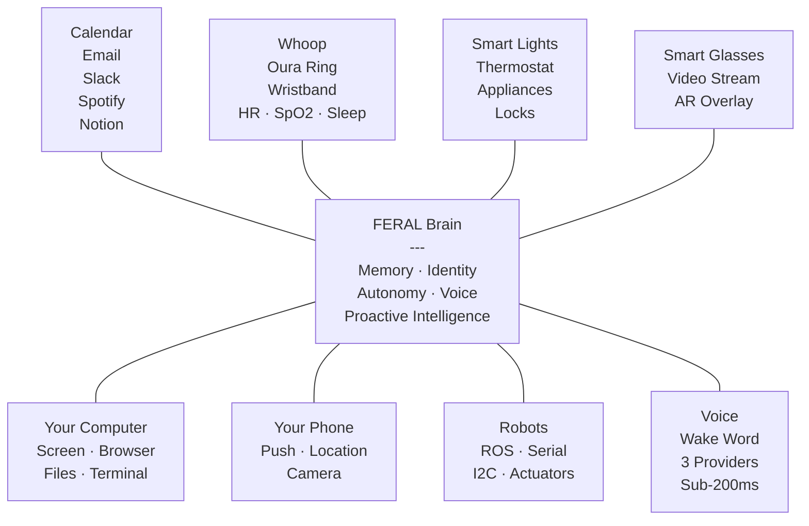
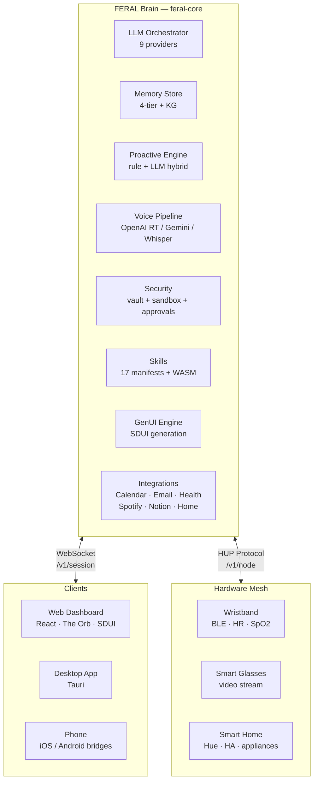

<p align="center">
  
</p>

<h3 align="center">One brain. Every device. Your entire life.</h3>
<p align="center"><em>The open-source AI that connects to everything you own — wristband, glasses, home, computer, phone, robots — learns your baseline, and runs things the way you would. Locally. Privately. No cloud.</em></p>

<p align="center">
  <a href="#the-idea">The Idea</a> &nbsp;·&nbsp;
  <a href="#what-it-does">What It Does</a> &nbsp;·&nbsp;
  <a href="#get-started">Get Started</a> &nbsp;·&nbsp;
  <a href="#demos">Demos</a> &nbsp;·&nbsp;
  <a href="#architecture">Architecture</a> &nbsp;·&nbsp;
  <a href="#contributing">Contributing</a>
</p>

<p align="center">
  <a href="https://github.com/FERAL-AI/FERAL-AI/stargazers"></a>
  <a href="https://github.com/FERAL-AI/FERAL-AI/commits/main"></a>
  
  
  
</p>

---

> **OpenAI built a chatbot. Apple built Siri. Google built an ad machine. Meta open-sourced some weights and called it a day.**
>
> None of them built an AI that connects to your wristband, your smart glasses, your thermostat, your robot arm, your computer, and your phone — learns your routines, builds your baseline, and proactively manages your physical and digital world. All locally. All privately.
>
> **We did.** And we open-sourced all of it.

---

## The Idea

FERAL is **one local brain for every device you own**. It connects to your wristband, your smart glasses, your home, your computer, your phone, your robots — every device, every app, every sensor. It learns your daily baseline across all of them. And it proactively manages hardware, software, health data, and your environment through natural language and intent.



It talks to **every device** — wristbands, smart glasses, home appliances, robots, your computer, your phone. It integrates with **every app** — calendar, email, Telegram, Slack, Spotify, Notion. It builds a **living model** of your routines and health through persistent memory. And it acts based on the **level of autonomy you choose**:

| Mode | Behavior |
|------|----------|
| **Strict** | Every action requires your explicit approval via a confirmation card |
| **Hybrid** | Safe actions auto-execute; risky ones ask first |
| **Loose** | Full autopilot — FERAL acts, you review the log |

---

## What It Does

<table>
<tr>
<td width="50%" valign="top">

### 🧠 Persistent Memory
Episodic recall, knowledge graph, semantic search, notes wiki. Four memory tiers that remember your entire life — not just the current session.

### 🎙️ Sub-200ms Voice
Wake word detection, OpenAI Realtime + Gemini Live streaming, interrupt-and-resume. Three voice paths for every use case.

### 🏠 Hardware Mesh
Direct Bluetooth/local control of lights, sensors, wristbands, smart glasses, robots. No cloud roundtrip. 12+ device types.

### 💊 Live Health Data
Heart rate, SpO2, skin temp from your wristband in real-time. Whoop and Oura Ring integration. Sleep and recovery trends.

</td>
<td width="50%" valign="top">

### 🤖 Proactive Intelligence
FERAL doesn't wait for commands. It watches ambient context — screen, health, calendar — and speaks up when it has something valuable to say.

### 🖥️ Computer Use
File operations, bash execution, browser automation (CDP/Playwright), screen capture. It sees your screen and can act on it.

### 🎨 Server-Driven UI (GenUI)
The brain generates UI dynamically — charts, forms, cards, alerts — and pushes them to whatever screen you're looking at.

### 🪞 Digital Twin
"What would I think about this?" — FERAL builds a model of your preferences, decisions, and reasoning from your history. Ask your digital twin anything.

</td>
</tr>
</table>

<table>
<tr>
<td width="50%" valign="top">

### 📅 Calendar + Email + Messaging
Google Calendar, Gmail, Telegram, Slack, Discord — all integrated. Morning briefings that are real, not simulated.

### 🔒 Three Autonomy Levels
Strict, hybrid, or loose. Real enforcement via ApprovalManager + safety classification. Not just a config flag.

</td>
<td width="50%" valign="top">

### 📍 Location-Aware Triggers
GPS geofencing: "When I arrive at the office, brief me on my day." Enter/exit detection with configurable actions.

### 🌙 Ambient Mode
Always-on full-screen dashboard — next meeting, heart rate, active tasks, weather, last memory. Your AI life at a glance.

</td>
</tr>
</table>

---

## Comparison

| Dimension | Big AI (OpenAI, Apple, Google) | OpenClaw | **FERAL** |
|---|---|---|---|
| Where it runs | Their servers | Your terminal | **Your entire device ecosystem** |
| Memory | Forgets between sessions | Plugin-based | **4-tier + knowledge graph + P2P sync** |
| Voice | 2s latency, cloud-only | Extension-based | **Sub-200ms, wake word, 3 providers** |
| Health monitoring | No | No | **Real-time biometrics from wristband** |
| Smart home | Cloud API roundtrip | No | **Direct local mesh, no cloud** |
| Proactive intelligence | No | No | **Rule + LLM hybrid with coaching** |
| Identity / learning | No | Workspace files | **SOUL.md + USER.md + auto-learning** |
| Autonomy levels | No | No | **Strict / Hybrid / Loose** |
| GenUI | No | Canvas/A2UI | **Full SDUI generation engine** |
| Hardware protocol | No | Generic nodes | **Dedicated HUP + mesh** |
| Open source | Weights only | Yes | **Yes — brain, client, mobile, SDK, desktop** |

---

## Get Started

**One-liner** (installs everything, creates a virtual env):

```bash
curl -sSL https://raw.githubusercontent.com/FERAL-AI/FERAL-AI/main/scripts/install.sh | bash
```

After install, activate and run:

```bash
source ~/.feral-env/bin/activate
feral start
```

**Or clone manually:**

```bash
git clone https://github.com/FERAL-AI/FERAL-AI.git && cd FERAL-AI
make install       # or: cd feral-core && pip install -e ".[llm]"
feral start
```

Brain starts, UI opens, voice activates. No API key required for local models (Ollama auto-detected).

Want cloud LLM instead?

```bash
export ANTHROPIC_API_KEY=sk-...    # or OPENAI_API_KEY, or OPENROUTER_API_KEY
feral start
```

---

## Demos

### ☀️ The Morning Routine
You wake up. FERAL already knows your sleep data from the wristband. It briefs you: calendar, weather, overnight emails — unprompted. You say "lights to morning mode" and your Philips Hue shifts warm. All voice. All local context.

```bash
feral demo --scenario morning
```

### 💻 The Developer Flow
You're deep in VS Code. FERAL watches your screen, notices you've been stuck on the same error for 20 minutes. It interrupts: *"I see a null pointer on line 47 — the API response changed shape after the deploy at 3pm. Want me to fix it?"* It knows because it has your screen context AND your git history in memory.

```bash
feral demo --scenario developer
```

### 🔗 The Mesh
Phone, wristband, smart glasses, desktop — all connected. You start a conversation on your phone walking to work. Sit down at your desk. FERAL picks up exactly where you left off, now with your full screen context. Your heart rate spikes during a meeting — it dims the lights and queues a breathing exercise. No cloud. No subscription. Just your devices, talking to each other.

```bash
feral demo --scenario mesh
```

### 🤖 Ask Your Digital Twin
You're considering a job offer. Instead of pro/con lists, you ask: *"What would I think about this?"* FERAL's digital twin — built from your memory, preferences, and decision patterns — reasons through it as you would.

```bash
feral demo --scenario twin
```

---

## Architecture



**Brain** (`feral-core`): Python. FastAPI + WebSocket. LLM orchestration, tool execution, memory, proactive intelligence, voice pipeline, hardware mesh coordination.

**Client** (`feral-client`): React. Server-Driven UI. The Orb. Command palette. Ambient context strip. Timeline view. Pure renderer — the brain decides what to show.

**Nodes** (`feral-nodes`): Hardware bridges that connect physical devices to the brain via the mesh protocol. Wristband streams biometrics. Glasses stream video. Smart home controls actuators.

---

## The Stack

```
feral/
├── feral-core/          # Brain: Python, FastAPI, LLM orchestration
│   ├── agents/          # Orchestrator, proactive engine, digital twin, scheduler
│   ├── memory/          # Episodic, semantic, knowledge graph, vector search, sync
│   ├── voice/           # Wake word, OpenAI Realtime, Gemini Live, Whisper path
│   ├── hardware/        # HUP mesh protocol, device adapters
│   ├── integrations/    # Calendar, email, health, Spotify, Notion, Home Assistant
│   ├── skills/          # Plugin system, 17 manifests, WASM sandbox, marketplace
│   ├── perception/      # Screen capture, audio pipeline, sensor fusion, geofencing
│   ├── channels/        # Telegram, Discord, Slack, WhatsApp, push notifications
│   ├── genui/           # Server-driven UI generation + provider system
│   └── security/        # Vault, sandbox, permissions, approval gates
├── feral-client/        # Web UI: React, The Orb, SDUI renderer, Timeline, Ambient
├── feral-nodes/         # Hardware bridges: iOS, Android, phone, Python SDK
├── desktop/             # Desktop app: Tauri (Rust + Web)
├── sdk/                 # Developer SDK: Python + Node.js
└── docs/                # Documentation site (Docusaurus)
```

---

## Contributing

```bash
git clone https://github.com/FERAL-AI/FERAL-AI.git && cd FERAL-AI
cd feral-core && pip install -e ".[llm,dev]"
cd ../feral-client && npm install && npm run dev
```

See [CONTRIBUTING.md](CONTRIBUTING.md) for the full guide.

---

## Why "FERAL"?

Feral: *adjective* — (of an animal) in a wild state, especially after escape from captivity.

AI was supposed to be personal. To serve you. Instead, it got captured — locked behind subscriptions, harvested for training data, chained to someone else's cloud. Every "personal AI" on the market today is personal in name only.

FERAL is what happens when you break AI out of captivity and let it run wild on your own devices. It knows your heartbeat. It sees your screen. It controls your home. It remembers everything. And it never phones home.

Not because we're idealists. Because that's how it should have worked from the start.

**AI off the leash.**

---

<p align="center">
  <sub>Apache 2.0 · Made with spite and good intentions</sub>
</p>
