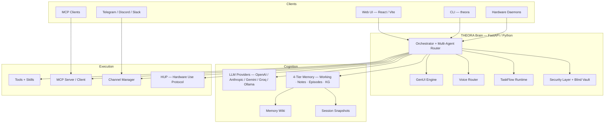

<p align="center">
  
</p>

<h1 align="center">THEORA</h1>

<p align="center">
  <strong>The open-source AI operating system for your devices.</strong>
</p>

<p align="center">
  <a href="https://pypi.org/project/theora-asos/"></a>
  <a href="https://github.com/Spatial-AgenticOS/ASOS/actions"></a>
  <a href="https://codecov.io/gh/Spatial-AgenticOS/ASOS"></a>
  <a href="https://pypi.org/project/theora-asos/"></a>
  <a href="https://www.npmjs.com/package/@theora/sdk"></a>
  <a href="LICENSE"></a>
</p>

<p align="center">
  <a href="#why-theora">Why THEORA</a> · <a href="#quick-start">Quick Start</a> · <a href="#sdk">SDK</a> · <a href="#architecture">Architecture</a> · <a href="#features">Features</a> · <a href="#installation">Install</a> · <a href="#project-structure">Structure</a> · <a href="#contributing">Contribute</a>
</p>

---

THEORA is a **local-first AI agent platform** that turns every device into an intelligent node. Voice, memory, workflows, generated UI, and hardware control ship as one cohesive runtime — not a bag of plugins. Your data, keys, and compute stay on your machine.

```bash
pip install theora-asos[llm]
theora setup   # guided 2-min config — pick a provider, paste a key, go
theora start   # brain + dashboard → http://localhost:9090
```

---

<a id="why-theora"></a>

## Why THEORA

THEORA and [OpenClaw](https://github.com/OpenClaw) occupy similar ground — open-source AI agent frameworks — but make fundamentally different architectural bets. The table below is an honest feature comparison.

| Capability | THEORA | OpenClaw |
|:-----------|:-------|:---------|
| **Hardware Use Protocol (HUP)** | Dedicated device mesh — wristbands, glasses, robots, and IoT nodes register via WebSocket with declarative manifests and stream telemetry natively | Generic plugin nodes; hardware not a first-class concept |
| **4-Tier Memory + Knowledge Graph** | Working → Notes → Episodes → Knowledge Graph, all in local SQLite with FTS + optional vector search. Memory Wiki compiles durable pages with provenance | Plugin-based memory; no built-in graph or wiki layer |
| **GenUI / SDUI** | Backend-driven dynamic UI: provider JSON contracts compile into cached SDUI surfaces; the client renders cards, charts, maps, forms on the fly | Canvas / A2UI — client-side component rendering |
| **Self-Learning Skills** | Agent auto-detects repeated patterns, generates skill manifests, and proposes new tools from usage history | Manual skill authoring only |
| **Voice** | Built-in dual-mode: OpenAI Realtime API (bidirectional, tool use mid-conversation) + Gemini Live; wake-word detection included | Voice via external extensions |
| **Identity System** | `IDENTITY.yaml` / `SOUL.md` / `MEMORY.md` / `TOOLS.md` — declarative personality, rules, and context that persist across sessions | Workspace files; no structured identity schema |
| **TaskFlows** | Durable SQLite-backed workflows with wait / resume / cancel / restart recovery | Cron-only scheduling |
| **MCP** | Dual-role: THEORA is both an MCP server (expose tools to Claude, Cursor) and an MCP client (consume external servers) | MCP client only |
| **Session Branching** | Snapshot, branch, and restore full conversation + memory state | No built-in branching |

> THEORA is not "better" at everything — OpenClaw has a larger plugin ecosystem and wider community today. THEORA's bet is that memory, hardware, and generated UI need to be **OS-level primitives**, not afterthought plugins.

---

<a id="quick-start"></a>

## Quick Start

```bash
# 1. Install
pip install theora-asos[llm]

# 2. Configure (interactive — pick provider, paste API key, name your agent)
theora setup

# 3. Launch brain + web dashboard
theora start
# → http://localhost:9090
```

Open the dashboard, type a message, or click the mic for voice. That's it.

```bash
# Or use the CLI directly:
theora "what files are in my home directory?"
theora "search the web for latest AI news"
theora "remember that my favorite color is blue"
theora "what's my favorite color?"
theora status
```

---

<a id="sdk"></a>

## SDK Quick Start

### Python

```python
from theora_sdk import TheoraClient, TheoraPlugin, theora_tool

# Talk to a running Brain
async with TheoraClient("http://localhost:9090") as client:
    reply = await client.chat("Summarize my last meeting notes")
    print(reply)

# Build a plugin
class WeatherPlugin(TheoraPlugin):
    name = "weather"
    description = "Real-time weather data"

    @theora_tool(description="Get current weather for a city")
    async def current(self, city: str) -> dict:
        return {"city": city, "temp_f": 72, "condition": "sunny"}
```

```bash
pip install theora-sdk
```

### Node / TypeScript

```typescript
import { TheoraClient } from '@theora/sdk';

const client = new TheoraClient('http://localhost:9090');
const health = await client.health();
const reply  = await client.chat('What can you do?');
const skills = await client.listSkills();
console.log(reply);
```

```bash
npm install @theora/sdk
```

---

<a id="architecture"></a>

## Architecture



### Data Flow

```
User Intent → Orchestrator → LLM (reasoning) → Tool / Skill Execution
                  ↕                                      ↓
             Memory Store ← ← ← ← ← ← ← ← ← ← Results + Learning
                  ↓
             GenUI Engine → SDUI Payload → Client Renderer
```

---

<a id="features"></a>

## Features

| | Feature | Description |
|:--|:--------|:------------|
| 🧠 | **Multi-Provider LLM** | OpenAI, Anthropic, Gemini, Groq, Ollama — hot-swap at runtime |
| 🗣️ | **Realtime Voice** | OpenAI Realtime API + Gemini Live; tool use mid-conversation; wake-word |
| 💾 | **4-Tier Memory** | Working → Notes → Episodes → Knowledge Graph; local SQLite + FTS + vector |
| 📖 | **Memory Wiki** | Compile notes/episodes/graph into durable wiki pages with provenance |
| 🔄 | **TaskFlows** | Durable background workflows — wait, resume, cancel, survive restarts |
| 🎨 | **GenUI / SDUI** | Backend-driven UI: cards, charts, maps, forms, provider surfaces |
| 🔌 | **Hardware (HUP)** | WebSocket device mesh — glasses, wristbands, robots, IoT |
| 🛠️ | **Computer Use** | Shell, file I/O, grep, web fetch, browser automation |
| 🌐 | **Web Search** | Tavily / DuckDuckGo with AI summaries |
| 🤖 | **Multi-Agent** | Router dispatches to specialist workers (health, home, research, creative) |
| 🔗 | **MCP Dual-Role** | Expose tools to Claude/Cursor **and** consume external MCP servers |
| 🧩 | **Skill System** | JSON manifests, Python plugins, WASM sandboxed skills, self-learning |
| 🆔 | **Identity** | `IDENTITY.yaml` / `SOUL.md` — persistent personality and rules |
| 🔀 | **Session Branching** | Snapshot, branch, and restore full conversation state |
| 📱 | **Channels** | Telegram, Discord, Slack, WhatsApp bridges |
| 🔐 | **Security** | Blind Vault for keys, WASM sandbox, permission plane |

---

<a id="installation"></a>

## Installation

### One-Liner

```bash
curl -sSL https://raw.githubusercontent.com/Spatial-AgenticOS/ASOS/main/scripts/install.sh | bash
```

### pip (recommended)

```bash
pip install theora-asos[llm]
theora setup
theora start        # → http://localhost:9090
```

### Docker

```bash
git clone https://github.com/Spatial-AgenticOS/ASOS.git && cd ASOS
cp .env.example .env   # add your API keys
docker compose up -d
# Brain: http://localhost:9090   Web UI: http://localhost:3000
```

### From Source

```bash
git clone https://github.com/Spatial-AgenticOS/ASOS.git && cd ASOS
make dev              # install brain + client deps
make serve            # brain on :9090
make client           # web UI dev server on :5173
```

### Nix (Linux)

```bash
nix develop           # dev shell with Python 3.11, Node 20, Rust
nix run .#brain       # run the brain directly
```

---

<a id="project-structure"></a>

## Project Structure

```
ASOS/
├── asos-core/                 # Agent brain — Python / FastAPI
│   ├── api/                   #   REST + WebSocket server, route modules
│   ├── agents/                #   Orchestrator, LLM provider, multi-agent router
│   ├── memory/                #   4-tier store, knowledge graph, wiki, ingest
│   ├── genui/                 #   GenUI / SDUI engine
│   ├── voice/                 #   Realtime proxy, Gemini Live, wake word
│   ├── hardware/              #   HUP protocol + device mesh
│   ├── skills/                #   Registry, executor, manifests, implementations
│   ├── mcp/                   #   MCP server + client
│   ├── identity/              #   IDENTITY.yaml / SOUL.md workspace loader
│   ├── security/              #   Blind vault, sandbox, permissions
│   ├── cli/                   #   `theora` command + setup wizard
│   └── webui/                 #   Bundled production web UI
├── asos-client/               # Web UI — React / Vite / Tailwind
├── sdk/
│   ├── python/                # theora-sdk — plugins, client, HUPDevice
│   └── node/                  # @theora/sdk — TypeScript client + plugin helpers
├── asos-nodes/                # Hardware daemon SDKs (iOS, Android, Python)
├── desktop/                   # Tauri 2 desktop shell
├── registry/                  # Skill marketplace server
├── docs/                      # Architecture, roadmap, specs
├── scripts/                   # Install, build, demo helpers
├── flake.nix                  # Nix dev shell + package outputs
├── docker-compose.yml
└── Makefile
```

---

<a id="contributing"></a>

## Contributing

### Get Started

```bash
git clone https://github.com/Spatial-AgenticOS/ASOS.git
cd ASOS/asos-core
pip install -e ".[llm,dev]"
pytest                        # run the test suite
theora setup && theora serve  # hack on a running brain
```

### Code Style

- **Python** — type hints everywhere, `ruff` for linting, `black`-compatible formatting.
- **TypeScript** — strict mode, Prettier.
- Keep functions short. Prefer composition over inheritance.

### Testing

```bash
pytest                         # unit + integration tests
pytest --cov --cov-report=term # with coverage (target: 70%)
```

### Pull Request Process

1. Fork and create a feature branch: `git checkout -b feat/my-feature`
2. Write tests for new functionality.
3. Ensure `pytest` passes and linting is clean.
4. Open a PR against `main` with a clear description.
5. One approval required to merge.

### Contributor Lanes

| Lane | Scope | Entry Points |
|:-----|:------|:-------------|
| **Runtime** | Agent loop, LLM routing, TaskFlows, sessions | `asos-core/agents/` |
| **Memory** | 4-tier store, wiki, ingest, sync | `asos-core/memory/` |
| **GenUI** | SDUI engine, provider contracts, client renderer | `asos-core/genui/`, `asos-client/` |
| **Hardware** | HUP protocol, daemon SDKs, device profiles | `asos-core/hardware/`, `asos-nodes/` |
| **Voice** | Realtime, Gemini Live, wake word, vision | `asos-core/voice/` |
| **Nix / Packaging** | Flake outputs, NixOS modules, CI | `flake.nix` |
| **Frontend** | Web UI, Tauri desktop, mobile bridges | `asos-client/`, `desktop/` |

### Docs for Contributors

- [`docs/ARCHITECTURE.md`](docs/ARCHITECTURE.md) — system architecture overview
- [`docs/RUNTIME_CONTRACT.md`](docs/RUNTIME_CONTRACT.md) — env vars, state paths, startup contract
- [`docs/GENUI_PROVIDER_SPEC.md`](docs/GENUI_PROVIDER_SPEC.md) — building GenUI provider surfaces
- [`docs/HARDWARE_ECOSYSTEM.md`](docs/HARDWARE_ECOSYSTEM.md) — building hardware daemons
- [`docs/ROADMAP.md`](docs/ROADMAP.md) — strategic execution order
- [`docs/SCORECARD.md`](docs/SCORECARD.md) — honest capability status

---

## Contact

**Alpay Kasal** — [info@theora.io](mailto:info@theora.io)

## License

Apache 2.0 — see [LICENSE](LICENSE) and [NOTICE](NOTICE).

Copyright 2024–2026 THEORA, Inc. Created by Mahmoud Omar and Alpay Kasal.
