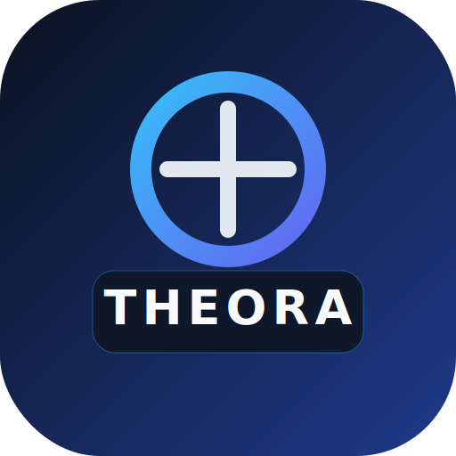
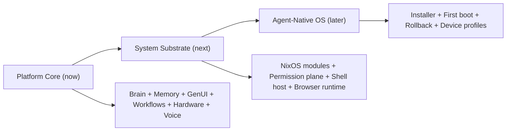
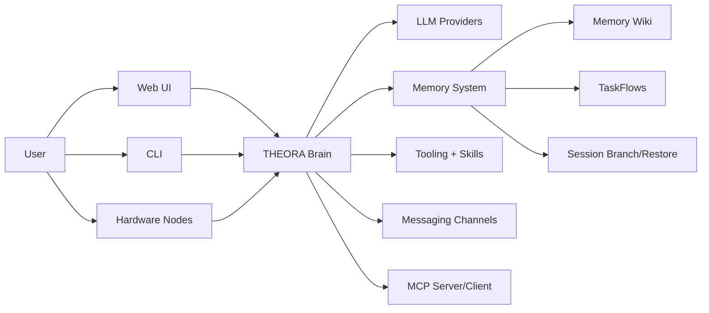
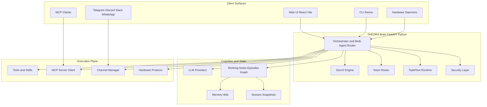

<p align="center">
  
</p>

<h1 align="center">THEORA</h1>

<p align="center">
  <strong>Open-source agent-native computing platform.<br/>Voice, memory, workflows, GenUI, hardware control, and a path toward an agent-native OS.</strong>
</p>

<p align="center">
  <a href="#why-this-exists">Vision</a> •
  <a href="#install">Install</a> •
  <a href="#at-a-glance">At a Glance</a> •
  <a href="#features">Features</a> •
  <a href="#architecture">Architecture</a> •
  <a href="#genui">GenUI</a> •
  <a href="#voice">Voice</a> •
  <a href="#memory">Memory</a> •
  <a href="#hardware">Hardware</a> •
  <a href="#mcp">MCP</a> •
  <a href="#contribute">Contribute</a>
</p>

<p align="center">
  
  
  
  
</p>

---

> **ASOS** (Spatial-AgenticOS) is the repository name. **THEORA** is the platform and product.

<a id="why-this-exists"></a>
## Why This Exists

Most AI projects give you a chatbot. THEORA is building something different: a **local-first agent-native computing platform**.

The long-term goal is a system where intelligence is not a feature inside an app, but the operating layer itself. Instead of opening separate apps, a user describes intent and the system acts, remembers, renders the right interface, and connects to the right device. Instead of hardcoded apps, service providers supply declarative contracts and the platform compiles and caches native-feeling surfaces on the fly.

That means:

- **Memory is a system service**, not a chat history that vanishes.
- **Workflows persist and resume**, not just run while a tab is open.
- **Interfaces are generated from contracts**, not shipped as separate native binaries.
- **Hardware devices are first-class nodes**, not afterthoughts behind an SDK wall.
- **The user controls their data, keys, and runtime** — local-first by design.

The destination is an agent-native system built on **NixOS minimal** that runs on PCs, phones, and device nodes. We are not there yet. What exists today is the working platform core that proves the path is real.

## Where We Are Going



Today, the core agent loops are working and demo-ready. The next wave is runtime hardening, OS-native integration, and ecosystem contracts. The long-term destination is a full agent-native operating system on NixOS minimal. See [`docs/ROADMAP.md`](docs/ROADMAP.md) for the full strategic roadmap and [`docs/SCORECARD.md`](docs/SCORECARD.md) for honest capability status.

## What is THEORA?

THEORA is a **local-first AI agent platform** that connects to your tools, devices, and data. Unlike cloud-only assistants, THEORA runs on your machine — your conversations, memory, and API keys never leave your control.

It can:
- **Use your computer** — run shell commands, read/write files, search codebases
- **Search the web** — real-time web search with AI summaries
- **Talk to you** — bi-directional voice conversation via OpenAI Realtime API, with tool use mid-conversation
- **Remember everything** — 4-tier persistent memory (notes, episodes, knowledge graph)
- **Build durable knowledge** — compile notes/episodes/graph into Memory Wiki pages, then browse/search
- **Run background workflows** — persistent TaskFlows that can wait, resume, and survive restarts
- **Branch conversations safely** — snapshot, branch, and restore sessions without losing context
- **Render rich UI** — tool results display as cards, metrics, and interactive components (GenUI)
- **Control hardware** — smart glasses, wristbands, IoT devices connect via WebSocket
- **Work with any LLM** — OpenAI, Anthropic Claude, Google Gemini, Groq, Ollama (local/free)
- **Use one stable local multimodal path** — Ollama vision preset (`ollama_vision` / `llava`)

<a id="at-a-glance"></a>
## At a Glance

### Product Surface



### Why It Feels Different

| Plane | What you get |
|:------|:-------------|
| **Reasoning Plane** | Multi-provider LLM routing + local vision path via Ollama preset |
| **Memory Plane** | Notes, episodes, graph, and compiled Memory Wiki with provenance |
| **Workflow Plane** | Restart-safe TaskFlows with wait/resume/cancel |
| **Conversation Plane** | Snapshot, branch, and restore sessions |
| **Interface Plane** | SDUI/GenUI cards, charts, maps, and interactive controls |
| **Execution Plane** | Computer-use tools, MCP integrations, channels, hardware daemons |

---

## Install

Three ways in, depending on how much control you want. All of them end at a working system with brain, dashboard, and setup wizard.

### Tier 1 — One Line, Everything Handled

```bash
curl -sSL https://raw.githubusercontent.com/Spatial-AgenticOS/ASOS/main/scripts/install.sh | bash
```

This checks Python 3.11+, installs THEORA via pip, and walks you through setup. You choose:
- **Terminal wizard** — 2-minute guided flow: pick an LLM provider, paste your key, name your agent, set personality and voice.
- **Web UI wizard** — full configuration with provider testing, skill browsing, app connections, and feature toggles.

After setup, one command runs everything:

```bash
theora start      # brain + dashboard at localhost:9090
```

The web UI opens automatically. If you skipped the terminal wizard, the web setup wizard starts on first visit.

> **Or install via pip directly:**
>
> ```bash
> pip install theora-asos[llm]
> theora setup        # guided configuration
> theora start        # brain + dashboard
> ```

### Tier 2 — Docker (Semi-Manual)

Clone the repo, set your keys, and Docker handles the rest. No Python or Node.js needed on your host.

```bash
git clone https://github.com/Spatial-AgenticOS/ASOS.git
cd ASOS
cp .env.example .env        # edit with your API keys
docker compose up -d
```

| Service | URL |
|:--------|:----|
| Brain + API | http://localhost:9090 |
| Web UI | http://localhost:3000 |
| Skill Registry | http://localhost:8080 |

The web UI setup wizard runs on first visit. Configure your LLM provider, keys, identity, skills, and connected apps from the browser.

To stop: `docker compose down`

### Tier 3 — Full Control (From Source)

For contributors and anyone who wants to modify the code.

```bash
git clone https://github.com/Spatial-AgenticOS/ASOS.git
cd ASOS
make dev            # installs brain + client deps
```

Then in separate terminals:

```bash
make serve          # start the brain (port 9090)
make client         # start the web UI dev server (port 5173)
```

Or use the individual commands:

```bash
pip install -e "asos-core[llm,dev]"     # brain with dev extras
cd asos-client && npm install           # web UI deps
theora setup                            # guided config
theora serve                            # brain server
cd asos-client && npm run dev           # web UI dev mode
```

Run `make help` for all available targets (test, docker, doctor, bundle-webui, clean).

**With Nix (Linux only):**

```bash
nix develop        # dev shell with Python 3.11, Node 20, Rust
nix run .#brain    # run THEORA brain directly
```

See [`docs/NIX.md`](docs/NIX.md) for package outputs and NixOS module details.

### What Happens During Setup

Regardless of which tier you choose, the setup flow configures:

| Step | What it does |
|:-----|:-------------|
| **LLM Provider** | Choose OpenAI, Anthropic, Gemini, Groq, or Ollama (free/local). API key validated live. |
| **Agent Identity** | Name, personality, voice, and behavioral rules saved to `~/.theora/` |
| **Skills & Tools** | Enable computer use, web search, vision, hardware control. Add API keys for Tavily, Spotify, etc. |
| **Connected Apps** | Spotify, Notion, Home Assistant — OAuth or token-based. |
| **Features** | Voice mode (realtime/classic/off), proactive behavior, streaming, wake word. |

All configuration is stored locally in `~/.theora/`. No cloud account needed. You can re-run setup anytime with `theora setup` or revisit the web UI wizard.

See [`docs/SCORECARD.md`](docs/SCORECARD.md) for current capability and demo-readiness status.

---

## Features

### Working & Tested

| Feature | Description |
|:--------|:------------|
| **Computer Use** | `bash`, `read_file`, `write_file`, `edit_file`, `grep_search`, `glob_search`, `web_fetch` |
| **Web Search** | Tavily-powered search with AI summaries |
| **Multi-Provider LLM** | OpenAI, Anthropic, Gemini, Groq, Ollama — switch at runtime |
| **Realtime Voice** | Bi-directional conversation via OpenAI Realtime API with tool use |
| **4-Tier Memory** | Working memory, notes, episodes, knowledge graph — all in local SQLite |
| **Memory Wiki** | Durable wiki pages compiled from notes/episodes/knowledge with browse/search APIs |
| **Bulk Ingest** | Ingest repo/PDF/text into memory, then compile wiki pages |
| **TaskFlows** | Persistent background workflows with waiting, resume, cancel, and restart recovery |
| **Session Branch/Restore** | Snapshot, branch, and restore chat sessions safely |
| **GenUI** | Tool results render as cards, metrics, lists, maps, and provider-defined fixed-layout surfaces |
| **Multi-Agent** | Router dispatches to specialist workers (health, home, research, creative) |
| **CLI Agent** | REPL mode, one-shot commands, status dashboard |
| **Setup Wizard** | `theora setup` — 7-step guided onboarding with identity, voice, memory config |
| **MCP Server** | Expose THEORA's tools to Claude Desktop, Cursor, or any MCP client |
| **MCP Client** | Connect external MCP servers — their tools merge into your agent |
| **Hardware Daemons** | WebSocket devices send telemetry and receive commands |
| **Skill Manifests** | Drop a JSON file to add any REST API as an agent tool |
| **Blind Vault** | API keys stored securely, never exposed to the LLM |
| **Hot Provider Switch** | `POST /api/llm/switch` — change LLM provider without restarting |
| **Provider Presets** | `GET /api/llm/presets`, `POST /api/llm/presets/apply` |
| **Self-Learning** | Agent learns routing preferences and extracts knowledge over time |
| **Web Dashboard** | React UI at `localhost:9090` — bundled with the server |

### API Keys Required

| Key | What For | Free Tier |
|:----|:---------|:----------|
| `OPENAI_API_KEY` | LLM + Voice + Vision | Pay-as-you-go |
| `TAVILY_API_KEY` | Web search | Free at [tavily.com](https://tavily.com) |
| None | Use Ollama for free local LLM | `ollama serve` + `ollama pull llama3.1` |

---

## Quick Start

```bash
# Start the server
theora serve

# In another terminal — try these:
theora "what files are in my home directory?"
theora "search the web for latest AI news"
theora "remember that my favorite color is blue"
theora "what's my favorite color?"
theora status
theora skills
```

**Web UI:** Open [http://localhost:9090](http://localhost:9090) — chat, voice, and GenUI in your browser.

---

<a id="architecture"></a>
## Architecture



### Demo Story Flow (10 Beats)

```mermaid
flowchart LR
  setup[Setup + Identity] --> conversation[Text/Voice Conversation]
  conversation --> action[Computer/Browser Action]
  action --> ingest[Ingest Repo/PDF/Text]
  ingest --> wiki[Compile + Browse Memory Wiki]
  wiki --> taskflow[Run TaskFlow]
  taskflow --> branch[Snapshot + Branch + Restore]
  branch --> vision[Local Vision + GenUI Output]
  vision --> hardware[Hardware Telemetry + Control]
  hardware --> provider[Provider GenUI Surface]
```



---

<a id="genui"></a>
## GenUI Provider Model

THEORA's GenUI layer is not only for pretty tool output. It is also the path toward provider-defined application surfaces inside the OS.

Instead of shipping separate native apps for every platform, a service provider can register a JSON contract that describes:

- backend endpoints
- brand tokens and theme rules
- layout rules for stable navigation and action placement
- named surfaces such as `home`, `checkout`, or `trip_status`

THEORA compiles that surface into SDUI JSON the first time, stores it under `~/.theora/genui_surfaces/`, and reuses the cached layout on later visits. Runtime data can still hydrate placeholders, but the shell stays fixed.

### Why This Matters

| Challenge | THEORA approach |
|:----------|:----------------|
| **Performance and reliability** | Compile once, cache the surface, and reopen the static layout instantly instead of regenerating it every launch. |
| **Muscle memory and UX stability** | Lock the layout shape after first compile so primary actions and navigation stay where the user expects. |
| **Brand control and provider buy-in** | Providers keep control through explicit brand tokens, themes, and layout rules in the JSON contract. |

### Provider Contract Example

```json
{
  "provider_id": "rideos",
  "name": "RideOS",
  "description": "Ride hailing provider",
  "base_url": "https://api.rideos.example",
  "brand": {
    "primary_color": "#111827",
    "accent_color": "#10b981",
    "theme": "dark"
  },
  "ui_rules": {
    "layout_mode": "fixed",
    "brand_mode": "strict",
    "navigation_style": "bottom_tabs"
  },
  "cache_policy": {
    "mode": "static",
    "persist": true
  },
  "endpoints": [
    { "id": "quote", "method": "POST", "path": "/quote" },
    { "id": "book", "method": "POST", "path": "/book" }
  ],
  "surfaces": [
    {
      "id": "home",
      "title": "Book a Ride",
      "entry": true,
      "template": {
        "type": "VStack",
        "spacing": 16,
        "children": [
          { "type": "Text", "value": "$headline", "style": "headline" },
          { "type": "Button", "label": "$cta_label", "action_id": "request_ride" }
        ]
      }
    }
  ]
}
```

### Surface Lifecycle

1. Provider registers its JSON contract through the GenUI provider API.
2. THEORA compiles the named surface once into SDUI JSON.
3. The compiled surface is cached locally as the fixed layout shell.
4. Later opens reuse the cached shell and only hydrate runtime data.

---

<a id="voice"></a>
## Voice

THEORA supports **two voice modes**, configured during `theora setup`:

### Realtime Voice (recommended)

Bi-directional conversation through the **OpenAI Realtime API**. The agent hears you, responds with natural speech, and can **use tools mid-conversation** — search the web, check your notes, run commands, all while talking to you.

- Server-side VAD (voice activity detection)
- Interruption support — talk over the agent to stop it
- PCM16 24kHz audio streaming
- Works from the **web UI** (click the mic button) or **hardware daemons**

### Classic Voice (Whisper + TTS)

Speech-to-text via Whisper → brain processes → text-to-speech. Higher latency but works with any LLM provider.

### Configuration

```yaml
# ~/.theora/config.yaml
voice:
  mode: realtime    # realtime | whisper | disabled
  tts_voice: nova   # nova | sage | alloy | echo | shimmer
  wake_word: false   # "Hey THEORA" detection
```

---

<a id="memory"></a>
## Memory

THEORA uses a **4-tier local memory system** — richer than most AI agents:

| Tier | What | Persisted | Example |
|:-----|:-----|:----------|:--------|
| **Working** | Current conversation context | RAM (per-session) | Recent messages, tool results |
| **Notes** | Things you tell it to remember | SQLite + FTS | "Remember my WiFi password is..." |
| **Episodes** | Past conversation summaries | SQLite + FTS | Auto-generated after each session |
| **Knowledge Graph** | Facts and relationships | SQLite (S-P-O triples) | "User prefers dark mode" |

Plus an **execution log** that tracks every tool call for routing optimization.
On top of these tiers, THEORA also provides:
- **Memory Wiki** (durable compiled pages with provenance)
- **Session Snapshots** (branch and restore conversation + working memory states)

```bash
# Everything stored locally
~/.theora/memory.db      # SQLite database
~/.theora/sync_wal.db    # Federated sync WAL (optional)
```

**No cloud.** You own your data.

---

<a id="custom-tools"></a>
## Custom Tools

### JSON Manifest (any REST API)

Drop a file in `~/.theora/skills/`:

```json
{
  "skill_id": "my_api",
  "brand": { "name": "My API", "icon": "🔧", "primary_color": "#6c5ce7" },
  "description": "The LLM reads this to decide when to use your tool",
  "auth": { "type": "api_key", "api_key_header": "X-API-Key" },
  "endpoints": [{
    "id": "get_data",
    "method": "GET",
    "url": "https://api.example.com/data",
    "description": "Fetches data by query",
    "params": [{ "name": "query", "type": "string", "required": true }]
  }]
}
```

Set the key: `THEORA_KEY_my_api=your-key-here`

### Python-Backed Skill (complex logic)

For tools that need custom logic (not just HTTP calls), create a Python class. See `asos-core/skills/impl/computer_use.py` for a full example.

---

<a id="hardware"></a>
## Hardware

Any device can connect as a **hardware daemon** over WebSocket:

```python
import asyncio, json, websockets

async def main():
    uri = "ws://localhost:9090/v1/node?api_key=dev-secret-key"
    async with websockets.connect(uri) as ws:
        # Register
        await ws.send(json.dumps({
            "hop": "daemon", "type": "node_register",
            "payload": {
                "node_id": "my-sensor",
                "node_type": "sensor",
                "capabilities": ["temperature", "humidity"]
            }
        }))

        # Send telemetry
        while True:
            await ws.send(json.dumps({
                "hop": "daemon", "type": "telemetry",
                "payload": {
                    "node_id": "my-sensor",
                    "sensors": {"temperature_c": 22.5, "humidity": 45}
                }
            }))
            await asyncio.sleep(5)

asyncio.run(main())
```

**Supported devices:**
- Smart glasses (THEORA W300, any BLE-capable glasses)
- Wristbands (heart rate, SpO2, temperature)
- IoT devices (via Home Assistant bridge)
- Robots (custom daemon)
- Phone as Bluetooth bridge (iOS SDK included)

---

<a id="mcp"></a>
## MCP Integration

### THEORA as MCP Server

Expose THEORA's tools to Claude Desktop, Cursor, or any MCP-compatible client:

```json
{
  "mcpServers": {
    "theora": {
      "url": "http://localhost:9090/mcp"
    }
  }
}
```

Available MCP tools: `theora_chat`, `theora_bash`, `theora_web_search`, `theora_memory_query`, `theora_skill_list`

### THEORA as MCP Client

Connect external MCP servers — their tools automatically merge into your agent:

```json
// ~/.theora/mcp_servers.json
{
  "servers": [
    {
      "name": "github",
      "transport": "stdio",
      "command": "npx",
      "args": ["-y", "@modelcontextprotocol/server-github"]
    }
  ]
}
```

---

<a id="docker"></a>
## Docker

See [Tier 2 — Docker](#tier-2--docker-semi-manual) in the Install section above.

```bash
cp .env.example .env    # edit with your API keys
docker compose up -d    # brain + web UI + skill registry

# Brain:    http://localhost:9090
# Web UI:   http://localhost:3000
# Registry: http://localhost:8080
```

---

## Project Structure

```
ASOS/
├── asos-core/                  # Agent brain (Python, FastAPI)
│   ├── api/server.py           # WebSocket + REST server
│   ├── agents/                 # Orchestrator, multi-agent router, learner
│   │   ├── orchestrator.py     # Main agentic loop
│   │   ├── llm_provider.py     # Multi-provider LLM interface
│   │   └── multi_agent.py      # Specialist worker routing
│   ├── skills/                 # Tool registry, executor, manifests
│   │   ├── manifests/          # JSON skill definitions
│   │   └── impl/               # Python-backed skill implementations
│   ├── memory/                 # 4-tier store + federated sync
│   ├── voice/                  # Realtime proxy, router, audio pipeline
│   ├── cli/                    # CLI (theora command) + setup wizard
│   ├── security/               # Blind vault, permissions, WASM sandbox
│   ├── hardware/               # Hardware Use Protocol (HUP)
│   ├── mcp/                    # MCP server + client
│   └── config/                 # Identity, loader
├── asos-client/                # React web UI (Vite + Tailwind)
├── asos-nodes/                 # Hardware daemon SDKs
│   ├── python-node-sdk/        # Python daemon reference
│   ├── ios-bridge/             # iOS bridge (Swift)
│   └── android-bridge/         # Android bridge (Kotlin)
├── registry/                   # Skill marketplace server
│   ├── server.py               # FastAPI registry
│   ├── seed.py                 # Seed example skills
│   └── Dockerfile
├── desktop/                    # Tauri desktop app
│   ├── src-tauri/              # Rust + Tauri config
│   └── src/                    # React wrapper
├── scripts/
│   ├── install.sh              # curl installer
│   ├── test_sync.sh            # Two-node sync test
│   └── demo.py                 # Feature demo script
├── .github/workflows/
│   └── publish.yml             # PyPI publish on v* tags
└── docker-compose.yml
```

---

## Configuration

All config lives in `~/.theora/`:

| File | What |
|:-----|:-----|
| `config.yaml` | Feature flags, LLM provider, voice mode, security |
| `credentials.json` | API keys (chmod 600, auto-loaded at startup) |
| `identity.yaml` | Agent name, personality, voice, rules |
| `memory.db` | Persistent memory (SQLite) |
| `genui_surfaces/` | Cached fixed-layout GenUI provider surfaces |
| `skills/` | Custom skill manifests |
| `mcp_servers.json` | External MCP server connections |

### Environment Variables

| Variable | What | Default |
|:---------|:-----|:--------|
| `OPENAI_API_KEY` | LLM + voice | — |
| `ANTHROPIC_API_KEY` | Claude models | — |
| `GEMINI_API_KEY` | Google Gemini | — |
| `GROQ_API_KEY` | Groq (fast inference) | — |
| `TAVILY_API_KEY` | Web search | — |
| `THEORA_LLM_PROVIDER` | Provider override | `openai` |
| `THEORA_LLM_MODEL` | Model override | `gpt-4o-mini` |
| `NODE_API_KEY` | Daemon authentication | `dev-secret-key` |

---

## REST API

| Endpoint | Method | Description |
|:---------|:-------|:------------|
| `/health` | GET | Server health check |
| `/api/info` | GET | System info and capabilities |
| `/api/llm/status` | GET | Current LLM provider and availability |
| `/api/llm/switch` | POST | Hot-swap LLM provider |
| `/api/llm/presets` | GET | List named provider/model presets |
| `/api/llm/presets/apply` | POST | Apply a preset (e.g. `ollama_vision`) |
| `/api/genui/providers/register` | POST | Register a provider JSON contract with brand rules, endpoints, and surfaces |
| `/api/genui/providers` | GET | List registered GenUI providers and metadata |
| `/api/genui/providers/{provider_id}/surfaces` | GET | List provider surfaces and cache status |
| `/api/genui/providers/{provider_id}/surfaces/{surface_id}` | GET | Get one surface contract and cached layout |
| `/api/genui/providers/{provider_id}/surfaces/compile` | POST | Compile and cache a fixed provider surface layout |
| `/api/genui/providers/{provider_id}/surfaces/render` | POST | Render runtime data into the cached provider surface |
| `/api/wiki/compile` | POST | Compile notes/episodes/graph into Memory Wiki pages |
| `/api/wiki/pages` | GET | List/search wiki pages |
| `/api/wiki/pages/{page_id}` | GET | Get one wiki page |
| `/api/wiki/stats` | GET | Wiki page counts and kind breakdown |
| `/api/wiki/ingest` | POST | Ingest raw note into wiki pipeline |
| `/api/wiki/ingest/text` | POST | Ingest text payload and compile wiki |
| `/api/wiki/ingest/pdf` | POST | Ingest local PDF and compile wiki |
| `/api/wiki/ingest/repo` | POST | Ingest local repo files and compile wiki |
| `/api/taskflows` | POST/GET | Create or list TaskFlows |
| `/api/taskflows/{flow_id}` | GET | Get TaskFlow details and step timeline |
| `/api/taskflows/{flow_id}/resume` | POST | Resume waiting/failed TaskFlow |
| `/api/taskflows/{flow_id}/cancel` | POST | Cancel TaskFlow |
| `/api/session/snapshot` | POST | Create session snapshot |
| `/api/session/snapshots` | GET | List session snapshots |
| `/api/session/snapshots/{snapshot_id}` | GET | Get snapshot detail (history + working memory) |
| `/api/session/branch` | POST | Branch from snapshot/session |
| `/api/session/restore` | POST | Restore snapshot into current/new session |
| `/api/voice/status` | GET | Voice subsystem status |
| `/api/dashboard` | GET | Full dashboard data |
| `/api/identity` | GET | Agent identity config |
| `/skills` | GET | List all loaded skills |
| `/api/devices` | GET | Connected hardware devices |
| `/v1/session` | WS | Client WebSocket (chat, voice, UI events) |
| `/v1/node` | WS | Hardware daemon WebSocket |
| `/mcp` | POST | MCP JSON-RPC endpoint |
| `/api/marketplace/search` | GET | Search skill marketplace |
| `/api/marketplace/install` | POST | Install a marketplace skill |
| `/api/sync/status` | GET | Federated sync status |
| `/api/sync/export` | GET | Export memory bundle |
| `/api/sync/import` | POST | Import memory bundle |
| `/docs` | GET | Interactive API documentation (Swagger) |

---

## What's New in v1.0

- **PyPI package** — `pip install theora-asos[llm]` (GitHub Actions publishes on `v*` tags)
- **Memory Wiki + ingest** — compile and browse durable wiki pages; ingest text, PDFs, and repos
- **TaskFlows UI + runtime** — create/list/resume/cancel workflows with persistent state
- **Session branch/restore UI** — snapshot, branch, and restore chat state from the web client
- **Provider/channel status plane** — dashboard cards for provider/channel/device visibility
- **Vision end-to-end** — browser webcam → VLM scene analysis, camera toggle in web UI
- **Wake word** — `theora wake-test` CLI command for testing, `openwakeword` ML model support
- **Android app** — fixed compilation, Gradle wrapper, buildable AAR + APK
- **Desktop GUI** — Tauri 2 app with system tray, Brain server auto-detect
- **Skill marketplace** — aligned API routes, seeded 5 example skills, `theora marketplace` CLI, Docker service
- **Federated sync** — fixed deadlock, LAN IP resolution, passphrase auth, `scripts/test_sync.sh`

## What's Not Done Yet

- **Custom wake word model** — "Hey THEORA" needs a trained `openwakeword` model; defaults to `hey_jarvis`
- **PyPI account setup** — package is ready to publish; needs PyPI token and a `v*` tag
- **Desktop pre-built binaries** — Tauri builds require Rust toolchain; no CI binary yet
- **Marketplace deployment** — registry runs locally via Docker; no public hosted version yet

---

<a id="contribute"></a>
## Contribute

THEORA is building toward an agent-native operating system. That is a large mission and we need help from different kinds of engineers.

### Quick Start

```bash
git clone https://github.com/Spatial-AgenticOS/ASOS.git
cd ASOS/asos-core
pip install -e ".[llm,dev]"
pytest                    # run tests
theora setup              # configure locally
theora serve              # start developing
```

### Contributor Lanes

| Lane | What you would work on | Entry points |
|:-----|:-----------------------|:-------------|
| **Runtime / Orchestrator** | Agent loop, LLM routing, TaskFlows, sessions, security | `asos-core/agents/`, `asos-core/api/server.py` |
| **Memory / Knowledge** | 4-tier memory, wiki compilation, ingest pipelines, federated sync | `asos-core/memory/` |
| **GenUI / Provider Surfaces** | SDUI engine, provider contracts, surface caching, client renderer | `asos-core/genui/`, `asos-client/src/components/SduiRenderer.jsx` |
| **Hardware / Daemons** | Node protocol, daemon SDKs, device profiles, edge bridges | `asos-core/hardware/`, `asos-nodes/` |
| **Voice / Perception** | Realtime voice, wake word, vision pipeline, multimodal fusion | `asos-core/voice/`, `asos-core/perception/` |
| **Nix / Packaging** | Flake outputs, NixOS modules, reproducible builds, service graph | `flake.nix`, `docs/NIX.md` |
| **Frontend / Shell** | Web UI, dashboard, Tauri desktop, mobile bridges | `asos-client/`, `desktop/` |

### Key Docs for Contributors

- [`docs/DEVELOPER_MISSION.md`](docs/DEVELOPER_MISSION.md) — The full mission and what we are building toward
- [`docs/ARCHITECTURE.md`](docs/ARCHITECTURE.md) — Tri-node architecture and protocol overview
- [`docs/RUNTIME_CONTRACT.md`](docs/RUNTIME_CONTRACT.md) — Env vars, state paths, startup/shutdown contract
- [`docs/GENUI_PROVIDER_SPEC.md`](docs/GENUI_PROVIDER_SPEC.md) — How to build a GenUI provider surface
- [`docs/HARDWARE_ECOSYSTEM.md`](docs/HARDWARE_ECOSYSTEM.md) — How to build a hardware daemon
- [`docs/SCORECARD.md`](docs/SCORECARD.md) — What is shipped, partial, and planned
- [`docs/ROADMAP.md`](docs/ROADMAP.md) — Strategic execution order
- [`CONTRIBUTING.md`](CONTRIBUTING.md) — Development workflow and guidelines

---

## Contact

**Alpay Kasal** — [info@theora.io](mailto:info@theora.io)

## License

Apache 2.0 with attribution — see [NOTICE](NOTICE).

> Built with [THEORA](https://github.com/Spatial-AgenticOS/ASOS)

Copyright 2024–2026 THEORA, Inc. Created by Mahmoud Omar and Alpay Kasal.
