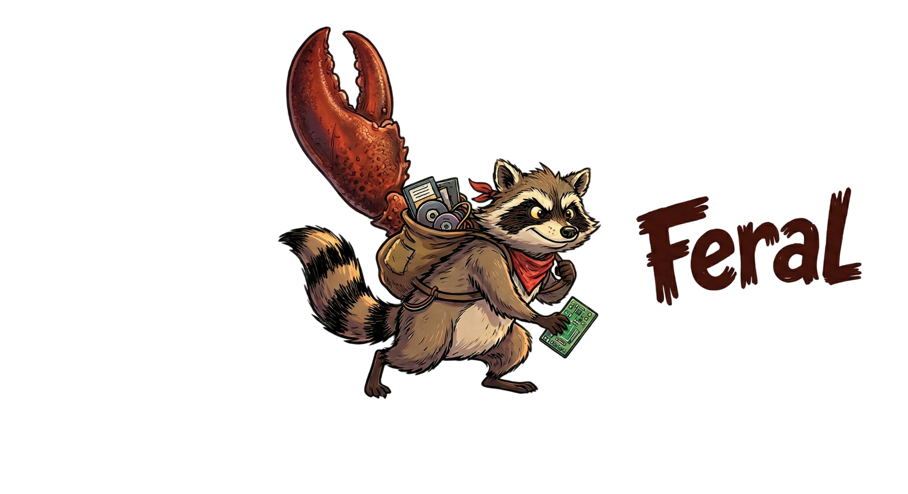
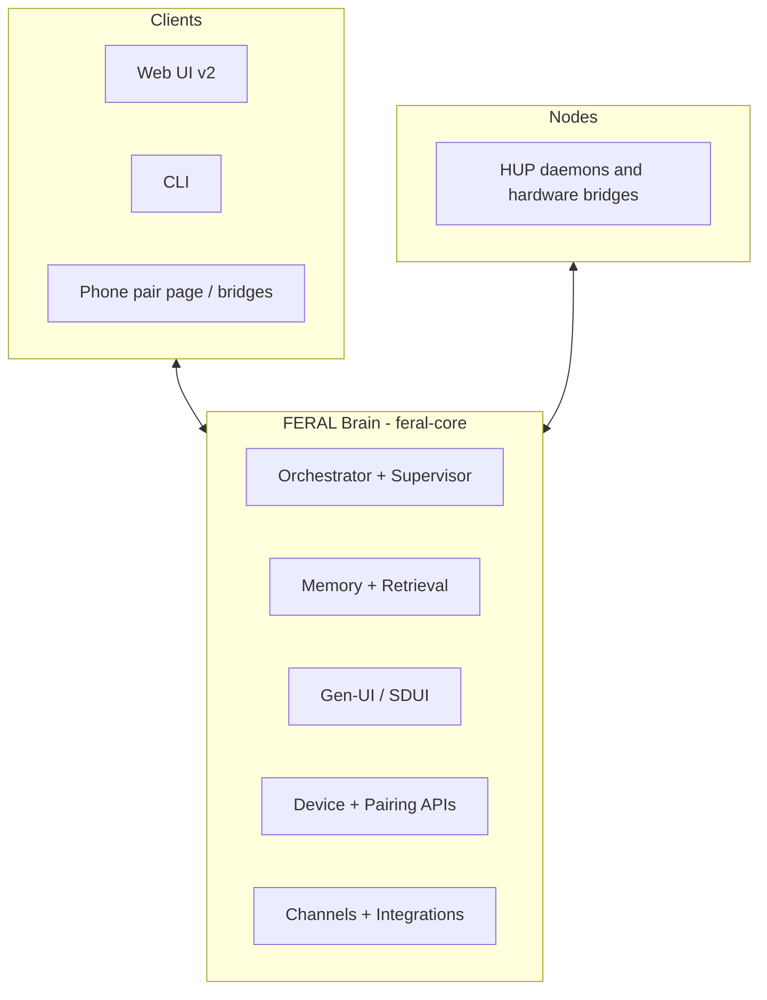

<p align="center">
  
</p>

<h3 align="center">One local brain for apps, devices, and memory.</h3>
<p align="center"><em>Install FERAL on your machine. It connects software and hardware, keeps long-lived memory, learns your baseline, and executes with explicit control.</em></p>

<p align="center">
  <a href="#quickstart-pypi-first">Quickstart</a> &nbsp;·&nbsp;
  <a href="#pair-your-phone-lan-vs-anywhere">Pairing</a> &nbsp;·&nbsp;
  <a href="#what-gen-ui-actually-does">Gen-UI</a> &nbsp;·&nbsp;
  <a href="#stable-today">Stability</a> &nbsp;·&nbsp;
  <a href="#develop-from-source">Develop</a>
</p>

<p align="center">
  <!-- sync-versions:badge -->
  
  <!-- /sync-versions:badge -->
  <a href="https://github.com/FERAL-AI/FERAL-AI/stargazers"></a>
  <a href="https://github.com/FERAL-AI/FERAL-AI/commits/main"></a>
  
  
</p>

---

## What FERAL Is

FERAL is a local-first brain that sits in the middle of your software and physical devices. You run it on your own machine and connect apps, channels, and hardware through one runtime.

Core model:

- 4-layer memory: working context, episodic events, semantic/graph retrieval, and execution history.
- Baseline learning: rolling metrics and anomaly/trend detection for what "normal" looks like for you.
- Digital twin actions: policy-gated autonomy with approval, time-window, and daily-cap controls.
- Publisher model: developers ship headless API/CLI contracts and app manifests; FERAL renders structured Gen-UI surfaces locally.
- Registry review gate: submissions are not user-installable until approved by FERAL org reviewers.

Today this ships as `feral-core` (brain runtime), `feral-client-v2` (web control surface), and `feral-nodes` (device/node bridges).

## Status

- Package: `feral-ai` on PyPI, current CalVer `2026.5.13`.
- Maturity: Beta (single-user local deployment is the primary target).
- Default startup mode: "This Mac only" pairing until you opt into LAN or Anywhere.

## Quickstart (PyPI First)

```bash
pip install "feral-ai[all]"
feral setup
feral start
```

Then open `http://localhost:9090`.

What this gives you:

- A local brain server on port `9090`.
- Bundled Web UI v2 served by the brain.
- Local config under `~/.feral/`.

Useful commands:

```bash
feral serve     # headless brain only
feral status    # runtime status
feral doctor    # diagnostics
```

If you prefer the installer script:

```bash
curl -sSL https://raw.githubusercontent.com/FERAL-AI/FERAL-AI/main/scripts/install.sh | bash
source ~/.feral-env/bin/activate
feral start
```

## Pair Your Phone: LAN vs Anywhere

FERAL exposes three pairing modes:

| Mode | UI label | Best for | Requirement |
|---|---|---|---|
| `local` | Same WiFi | Phone and brain on same network | Brain must be reachable on LAN |
| `remote` | Anywhere | Pair/use from outside your LAN | Tailscale installed and Funnel enabled |
| `localhost` | This Mac only | No phone pairing yet | No extra setup |

### LAN (Same WiFi)

1. In setup, choose **Same WiFi**.
2. Open `Devices` -> `Pair new device` -> `Web phone`.
3. Click **Generate one-time link** and scan the QR from your phone.
4. If PIN is enabled, enter the 4-digit PIN shown on the Mac.

If the generated LAN URL is unreachable from your phone, restart the brain on all interfaces:

```bash
FERAL_HOST=0.0.0.0 feral start
```

### Anywhere (Remote via Tailscale)

Setup now attempts this automatically when you choose **Anywhere**.
You can also manage it later in `Settings` -> `Access`.

1. In setup, choose **Anywhere**.
2. If setup reports a tunnel error, run:

```bash
feral access remote-up
```

3. Complete any Tailscale prompts (`tailscale up`, Funnel enable URL) if requested.
4. Generate a new pairing link from `Devices` and scan it from anywhere.

Check status any time:

```bash
feral access status
```

Disable remote mode:

```bash
feral access remote-down
```

### This Mac only

Use this if you want local dashboard/chat without phone pairing yet.

## What Gen-UI Actually Does

Gen-UI in FERAL is server-driven UI (SDUI), not freeform frontend generation.

- The brain emits structured UI payloads; the client renders known component types.
- Payload updates can be streamed as `sdui_patch` deltas.
- Third-party app surfaces run in a sandboxed model with explicit contracts.
- The `/canvas` view is a live inspector/debug surface for SDUI frames.

What it is not yet:

- Not a native iOS/Android SDUI renderer parity story.
- Not a fully signed marketplace trust model end-to-end.

## Stable Today

<!-- sync-versions:test-counts pytest=3431 vitest=283 -->
Current CI snapshot: **2842 backend + 259 frontend tests**.
<!-- /sync-versions:test-counts -->

| Area | Current state |
|---|---|
| Chat and LLM orchestration | Stable |
| Memory core (episodic/semantic/graph) | Stable |
| Setup + CLI runtime control | Stable |
| Web UI v2 core flows | Stable |
| Pairing lifecycle (token, claim, prune) | Stable |
| Voice, channels, and integrations | Stable with provider/runtime dependencies |
| Gen-UI advanced app-platform features | Mixed (stable core renderer, evolving platform contracts) |
| Long-tail ecosystem claims | Vary by integration; verify before production commitments |

## Recent Release Focus (Last 10 Bumps)

- `v2026.5.10`: pairing lifecycle hardening, explicit token issuance UX, embedding fallback resilience.
- `v2026.5.9`: fixed pairing token leak behavior and improved pairing/marketplace UX errors.
- `v2026.5.8`: introduced pairing access modes (Same WiFi / This Mac only / Anywhere), setup flow updates, and remote access wiring.
- `v2026.5.7`: refreshed bundled Web UI assets to keep release/runtime coherence.
- `v2026.5.6`: runtime reliability hardening wave.
- `v2026.5.5`: release pipeline hardening for wheel smoke/install checks.
- `v2026.5.4`: fixed base-wheel dependency coherence (`prometheus-client`).
- `v2026.5.3`: incident recovery hardening.
- `v2026.5.2`: provider/runtime truth fixes and secure credential flow hardening.
- `v2026.5.1`: post-`v2026.5.0` hotfix wave for provider switching, model picker/runtime params, and credential leak regressions.

## Architecture in 60 Seconds



## Develop From Source

```bash
git clone https://github.com/FERAL-AI/FERAL-AI.git
cd FERAL-AI
make dev

# brain (headless)
feral serve

# web client v2 (optional live dev)
cd feral-client-v2
npm run dev
```

## Docs

- User docs: `docs/mintlify/`
- Architecture deep dive: `docs/orchestration.md`
- Contribution guide: `CONTRIBUTING.md`
- Security policy: `SECURITY.md`

## What FERAL Is Not

- Not a managed cloud service.
- Not a guaranteed multi-tenant/high-availability platform today.
- Not a claim that every listed integration is equal maturity in every environment.

## Created By

**[Mahmoud Omar](https://github.com/mahmoudomar)** and **[Alpay Kasal](https://github.com/alpaykasal)**

Contact: [info@feral.sh](mailto:info@feral.sh) | Website: [feral.sh](https://feral.sh) | GitHub: [FERAL-AI](https://github.com/FERAL-AI)
