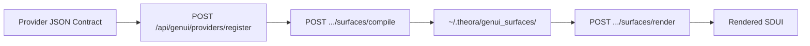

# GenUI Provider Surface Specification

This document defines the contract for building a GenUI provider surface in THEORA. A provider surface replaces a traditional hardcoded app with a declarative JSON contract that THEORA compiles, caches, and hydrates at runtime.

## How It Works

1. A service provider submits a JSON contract via `POST /api/genui/providers/register`.
2. THEORA compiles each named surface into SDUI JSON once.
3. The compiled layout is cached under `~/.theora/genui_surfaces/{provider_id}/{surface_id}.json`.
4. On subsequent opens, the cached layout is loaded instantly and hydrated with runtime data.



## Provider Contract Format

```json
{
  "provider_id": "string (unique, required)",
  "name": "string (display name)",
  "description": "string",
  "base_url": "string (backend API base URL)",
  "brand": {
    "primary_color": "#hex",
    "accent_color": "#hex",
    "theme": "dark | light",
    "logo_url": "string (optional)"
  },
  "ui_rules": {
    "layout_mode": "fixed | adaptive",
    "brand_mode": "strict | relaxed",
    "navigation_style": "bottom_tabs | sidebar | none"
  },
  "cache_policy": {
    "mode": "static | disabled",
    "persist": true
  },
  "endpoints": [
    {
      "id": "string",
      "method": "GET | POST | PUT | DELETE",
      "path": "/relative/path"
    }
  ],
  "components": [
    {
      "id": "string",
      "schema": {
        "template": { "SDUI component tree with $placeholder values" }
      }
    }
  ],
  "surfaces": [
    {
      "id": "string (surface identifier)",
      "title": "string (display title)",
      "entry": true,
      "template": { "SDUI component tree" }
    }
  ]
}
```

## Surfaces

A surface is a named screen or view within the provider. Each surface has:

| Field | Type | Required | Description |
|:------|:-----|:---------|:------------|
| `id` | string | yes | Unique surface identifier within the provider |
| `title` | string | yes | Display title |
| `entry` | boolean | no | Whether this is the default surface |
| `template` | object | recommended | Pre-defined SDUI component tree |
| `prompt` | string | fallback | Used for LLM-based generation if no template is provided |

If a surface has a `template`, that template is used directly as the compiled layout. If no template is provided, THEORA uses the LLM to generate one from the `prompt` field and the provider context.

## SDUI Component Types

The following component types are available in surface templates:

| Type | Purpose | Key properties |
|:-----|:--------|:---------------|
| `VStack` | Vertical layout | `spacing`, `padding`, `children` |
| `HStack` | Horizontal layout | `spacing`, `padding`, `children` |
| `Text` | Text display | `value`, `style` (headline/subtitle/body/caption), `color` |
| `Card` | Card container | `corner_radius`, `children` |
| `Button` | Action button | `label`, `action_id`, `color` |
| `Image` | Image display | `url`, `corner_radius` |
| `MapView` | Interactive map | `lat`, `lon`, `zoom`, `markers`, `height` |
| `Chart` | Data chart | `data`, `chart_type` (line/bar), `label`, `height` |
| `Table` | Data table | `headers`, `rows` |
| `Form` | Input form | `fields`, `submit_label`, `action_id` |
| `MetricCard` | Single metric | `label`, `value`, `icon`, `color` |
| `Badge` | Status badge | `value`, `color` |
| `Divider` | Visual separator | (none) |
| `Icon` | Icon display | `name`, `color`, `size` |
| `CodeBlock` | Code display | `value`, `language` |
| `Markdown` | Markdown text | `value` |
| `ProgressBar` | Progress indicator | `value`, `color` |
| `WebView` | Embedded web content | `url`, `height` |
| `Grid` | Grid layout | `columns`, `children` |
| `ScrollView` | Scrollable container | `children` |
| `AudioPlayer` | Audio playback | `url` |
| `VideoPlayer` | Video playback | `url` |

## Placeholder Hydration

Template values prefixed with `$` are hydrated at render time with runtime data.

Template:
```json
{"type": "Text", "value": "$headline", "style": "headline"}
```

Render data:
```json
{"headline": "Your ride is 2 minutes away"}
```

Result:
```json
{"type": "Text", "value": "Your ride is 2 minutes away", "style": "headline"}
```

Hydration is recursive: `$` placeholders inside nested children and properties are all resolved.

## API Endpoints

| Endpoint | Method | Description |
|:---------|:-------|:------------|
| `/api/genui/providers/register` | POST | Register a provider contract |
| `/api/genui/providers` | GET | List registered providers |
| `/api/genui/providers/{provider_id}/surfaces` | GET | List surfaces with cache status |
| `/api/genui/providers/{provider_id}/surfaces/{surface_id}` | GET | Get one surface contract and cached layout |
| `/api/genui/providers/{provider_id}/surfaces/compile` | POST | Compile and cache a surface layout |
| `/api/genui/providers/{provider_id}/surfaces/render` | POST | Render runtime data into cached layout |

### Compile

```bash
curl -X POST http://localhost:9090/api/genui/providers/rideos/surfaces/compile \
  -H 'Content-Type: application/json' \
  -d '{"surface_id": "home"}'
```

Response:
```json
{
  "ok": true,
  "provider_id": "rideos",
  "surface_id": "home",
  "cache_hit": false,
  "payload": { "type": "VStack", "children": [...] },
  "metadata": { "layout_mode": "fixed", "brand_mode": "strict" }
}
```

### Render

```bash
curl -X POST http://localhost:9090/api/genui/providers/rideos/surfaces/render \
  -H 'Content-Type: application/json' \
  -d '{"surface_id": "home", "data": {"headline": "Pick your ride", "cta_label": "Request"}}'
```

Response includes both the hydrated `payload` and the original `layout` for comparison.

## Complete Example

```json
{
  "provider_id": "rideos",
  "name": "RideOS",
  "description": "Ride hailing provider",
  "base_url": "https://api.rideos.example",
  "brand": {
    "primary_color": "#111827",
    "accent_color": "#10b981",
    "theme": "dark"
  },
  "ui_rules": {
    "layout_mode": "fixed",
    "brand_mode": "strict",
    "navigation_style": "bottom_tabs"
  },
  "cache_policy": {
    "mode": "static",
    "persist": true
  },
  "endpoints": [
    {"id": "quote", "method": "POST", "path": "/quote"},
    {"id": "book", "method": "POST", "path": "/book"}
  ],
  "surfaces": [
    {
      "id": "home",
      "title": "Book a Ride",
      "entry": true,
      "template": {
        "type": "VStack",
        "spacing": 16,
        "children": [
          {"type": "Text", "value": "$headline", "style": "headline"},
          {"type": "MapView", "lat": "$pickup_lat", "lon": "$pickup_lon", "zoom": 14, "height": 200},
          {"type": "Card", "corner_radius": 12, "children": [
            {"type": "HStack", "spacing": 8, "children": [
              {"type": "Text", "value": "$eta", "style": "subtitle"},
              {"type": "Text", "value": "$price", "style": "body"}
            ]}
          ]},
          {"type": "Button", "label": "$cta_label", "action_id": "request_ride", "color": "#10b981"}
        ]
      }
    }
  ]
}
```

## Design Principles

- **Compile once, reuse forever.** The layout is fixed after first compilation. Runtime data fills placeholders, but the structure does not change.
- **Provider controls brand.** Explicit `brand` tokens and `ui_rules` ensure the provider's visual identity is preserved.
- **Muscle memory is preserved.** `layout_mode: fixed` means navigation and actions stay in the same position across renders.
- **No LLM required for templated surfaces.** If the provider supplies a `template`, compilation is deterministic and instant.

## Implementation Reference

- Engine: `asos-core/genui/generator.py` (`GenUIEngine`, `ServiceProvider`, `ServiceProviderRegistry`)
- Client renderer: `asos-client/src/components/SduiRenderer.jsx`
- Tests: `asos-core/tests/test_genui.py`
- Cache directory: `~/.theora/genui_surfaces/`
