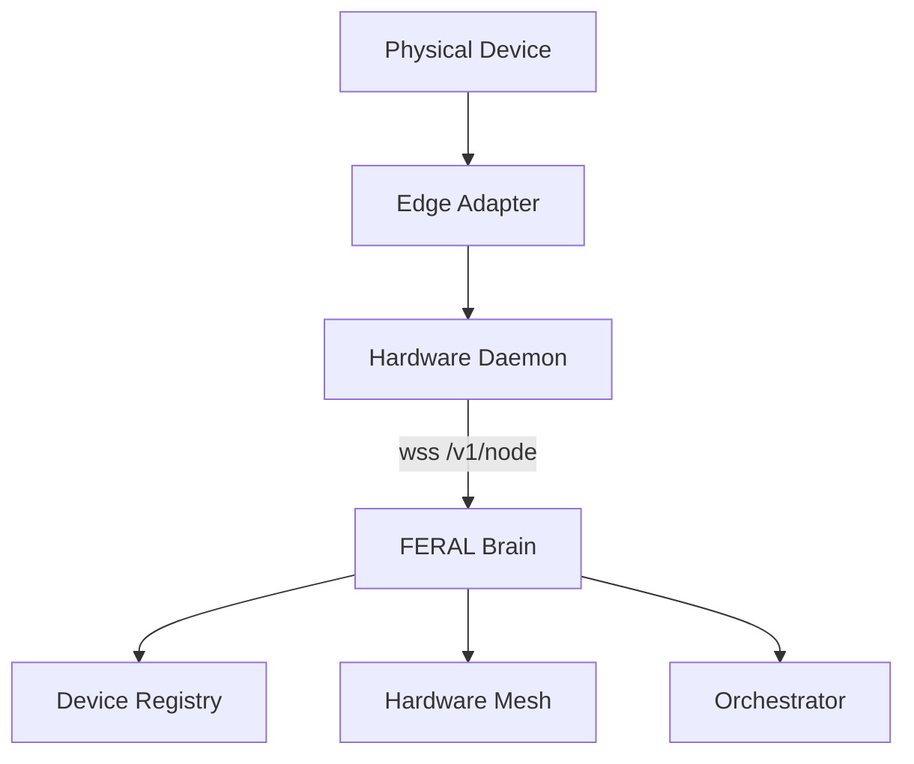

# FERAL Hardware Ecosystem

This document defines the contract for connecting hardware devices to FERAL. Any device class -- wearables, robotics, home appliances, IoT sensors, phone bridges -- uses the same protocol.

## Architecture



Devices connect to the FERAL Brain as **hardware daemons** over an authenticated WebSocket channel. The Brain auto-registers each daemon into the HUP (Hardware Use Protocol) device registry. The agent can then discover, query, and command any connected device through a universal abstraction.

## The Three-Layer Contract

### Layer 1: Transport

All daemons connect via WebSocket to `wss://{brain_host}:{brain_port}/v1/node?api_key={key}`.

The `api_key` query parameter authenticates the daemon. Set via the `NODE_API_KEY` environment variable (no default — must be configured before deployment).

### Layer 2: Device Manifest

On connection, every daemon sends a registration message declaring its identity, type, and capabilities.

**Registration message:**
```json
{
  "hop": "daemon",
  "type": "node_register",
  "payload": {
    "node_id": "unique-device-id",
    "node_type": "sensor | robot | glasses | phone | actuator | desktop",
    "platform": "linux | ios | android | rtos | custom",
    "capabilities": ["temperature", "humidity", "motor_control"]
  }
}
```

For richer integration, capabilities can be declared using the HUP `DeviceManifest` schema (see below). The Brain will auto-register daemons with either format.

### Layer 3: Execution

**Brain to daemon (command):**
```json
{
  "type": "command",
  "request_id": "abc123",
  "command": "sensor.read",
  "args": {"sensor_name": "temperature"}
}
```

**Daemon to brain (result):**
```json
{
  "hop": "daemon",
  "type": "execute_result",
  "payload": {
    "request_id": "abc123",
    "success": true,
    "data": {"temperature_c": 22.5}
  }
}
```

The `request_id` field correlates commands with results.

## Telemetry Streaming

Daemons can push telemetry data without being asked:

```json
{
  "hop": "daemon",
  "type": "telemetry",
  "payload": {
    "node_id": "wristband-01",
    "sensors": {
      "heart_rate": 72,
      "spo2": 98,
      "temperature_c": 36.5
    }
  }
}
```

Batch telemetry:
```json
{
  "hop": "daemon",
  "type": "sensor_batch",
  "payload": {
    "node_id": "wristband-01",
    "samples": [
      {"ts": 1712700000, "heart_rate": 71, "spo2": 98},
      {"ts": 1712700005, "heart_rate": 73, "spo2": 97}
    ]
  }
}
```

## Vision Frames

Devices with cameras can stream vision frames:

```json
{
  "hop": "daemon",
  "type": "vision_frame",
  "payload": {
    "node_id": "glasses-01",
    "image_b64": "base64-encoded-jpeg",
    "resolution": "640x480",
    "timestamp_ms": 1712700000000
  }
}
```

## HUP Device Manifest (Rich Registration)

For advanced integrations, daemons can declare a full HUP manifest:

```yaml
device_id: "robot-arm-01"
device_type: "robot"
name: "6-DOF Robot Arm"
manufacturer: "FERAL"
model: "ARM-600"
firmware_version: "1.2.0"
connection_type: "websocket"
battery_powered: false
location: "workshop"
tags: ["industrial", "actuator"]

capabilities:
  - id: "move_joint"
    name: "Move Joint"
    description: "Move a specific joint to a target angle"
    category: "actuator"
    permission_tier: "privileged"
    requires_confirmation: true
    reversible: true
    safety_notes: "Ensure workspace is clear before movement"
    parameters:
      - name: "joint_id"
        type: "integer"
        required: true
      - name: "angle_degrees"
        type: "number"
        required: true
      - name: "speed_pct"
        type: "number"
        default: 50
    returns:
      joint_id: "int"
      final_angle: "float"
      duration_ms: "int"

  - id: "read_position"
    name: "Read Position"
    description: "Get current joint positions"
    category: "sensor"
    permission_tier: "passive"
    returns:
      joints: "list[float]"
      timestamp: "float"

sensors: ["position", "force", "temperature"]
actuators: ["joint_motor", "gripper"]
```

## Permission Tiers

Every capability declares a permission tier:

| Tier | Allowed actions | Requires confirmation |
|:-----|:---------------|:---------------------|
| `passive` | Read-only: sensors, status, telemetry | No |
| `active` | Send data: notifications, display, audio | No |
| `privileged` | System modification: file access, commands | Yes |
| `dangerous` | Destructive: motor control at high speed, delete, financial | Yes |

The `ExecutionSandbox` in the Brain enforces these tiers and can apply per-skill rate limits.

## Reference Device Profiles

### Wearable Telemetry Node
A wristband or smart glasses that streams health and motion data.
- Type: `glasses` / `wristband`
- Capabilities: `heart_rate`, `spo2`, `temperature`, `steps`, `uv`, `accelerometer`
- Category: `sensor` (passive)
- Example: FERAL W300 glasses, health wristband

### Home Automation Bridge
A bridge to smart home devices (lights, HVAC, locks, appliances).
- Type: `home_bridge`
- Capabilities: `light_control`, `thermostat`, `lock`, `power_toggle`
- Category: `actuator` (active/privileged)
- Adapter: Home Assistant bridge, Zigbee/Z-Wave hub

### Robotics Actuator Node
A robot arm, drone, or mobile robot.
- Type: `robot`
- Capabilities: `move_joint`, `grip`, `navigate`, `read_position`, `read_force`
- Category: `actuator` (privileged/dangerous)
- Adapter: ROS bridge, serial, custom firmware

### Phone-as-Bridge Node
A smartphone that bridges BLE peripherals and provides camera/GPS/health.
- Type: `phone`
- Capabilities: `camera`, `gps`, `health_sensors`, `notification`, `haptic`
- Category: mixed
- SDKs: `feral-nodes/ios-bridge/`, `feral-nodes/android-bridge/`

## Building a Hardware Daemon

Minimal Python daemon:

```python
import asyncio
import json
import websockets

BRAIN_URL = f"ws://localhost:9090/v1/node?api_key={os.environ['NODE_API_KEY']}"

async def main():
    async with websockets.connect(BRAIN_URL) as ws:
        await ws.send(json.dumps({
            "hop": "daemon",
            "type": "node_register",
            "payload": {
                "node_id": "my-sensor",
                "node_type": "sensor",
                "capabilities": ["temperature", "humidity"],
            },
        }))

        async def send_telemetry():
            while True:
                await ws.send(json.dumps({
                    "hop": "daemon",
                    "type": "telemetry",
                    "payload": {
                        "node_id": "my-sensor",
                        "sensors": {"temperature_c": 22.5, "humidity": 45},
                    },
                }))
                await asyncio.sleep(5)

        async def handle_commands():
            async for raw in ws:
                msg = json.loads(raw)
                if msg.get("type") == "command":
                    result = execute_command(msg["command"], msg.get("args", {}))
                    await ws.send(json.dumps({
                        "hop": "daemon",
                        "type": "execute_result",
                        "payload": {
                            "request_id": msg["request_id"],
                            "success": True,
                            "data": result,
                        },
                    }))

        await asyncio.gather(send_telemetry(), handle_commands())

def execute_command(command, args):
    if command == "sensor.read":
        return {"temperature_c": 22.5, "humidity": 45}
    return {"error": f"Unknown command: {command}"}

asyncio.run(main())
```

## Edge Adapter Model

For devices that do not speak WebSocket natively, build an edge adapter:

```
Physical Device <--BLE/MQTT/Serial/ROS--> Edge Adapter <--WebSocket--> Brain
```

The edge adapter translates the device's native protocol into the daemon WebSocket contract. All edge adapters produce the same registration, telemetry, and command/result messages.

## REST API

| Endpoint | Method | Description |
|:---------|:-------|:------------|
| `/api/devices` | GET | List connected hardware devices |
| `/api/hardware/execute` | POST | Execute a HUP action on a device |
| `/api/hardware/status` | GET | Device registry stats |
| `/v1/node` | WS | Hardware daemon WebSocket channel |

## Implementation Reference

- Protocol: `feral-core/hardware/protocol.py` (`DeviceManifest`, `DeviceCapability`, `HUPAction`, `HUPResult`)
- Mesh: `feral-core/hardware/mesh.py` (`HardwareMesh`, `WebSocketNodeAdapter`)
- Server handler: `feral-core/api/server.py` (`/v1/node` WebSocket)
- Python SDK: `feral-nodes/python-node-sdk/`
- iOS bridge: `feral-nodes/ios-bridge/`
- Android bridge: `feral-nodes/android-bridge/`
