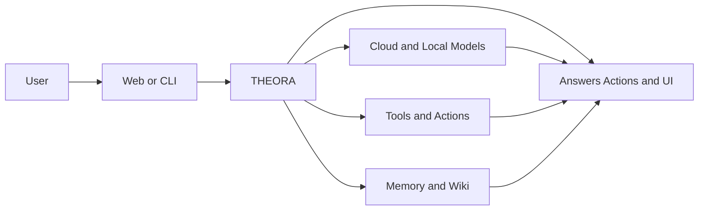
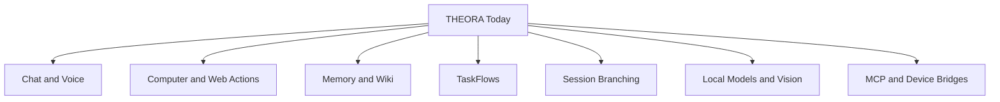
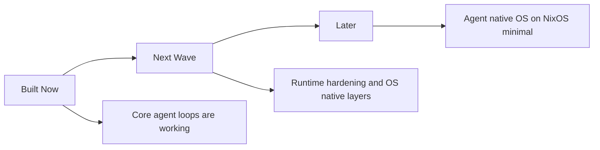

# THEORA One Pager

> THEORA is a local-first agent-native computing platform that can talk, act, remember, render structured interfaces, and connect to software and hardware over time while keeping the core experience under your control.

## In One Sentence

THEORA is a working platform today and a path toward an agent-native operating system tomorrow. It can chat by text or voice, use tools, remember information over time, run long tasks, branch conversations, render provider-defined interfaces, control hardware, and use local vision models.

## What THEORA Is

THEORA is an open-source agent-native computing platform designed to feel like more than a chatbot.

It combines:
- conversation by text and voice
- tool use on the computer and web
- durable local memory
- long-running workflows
- rich UI output via provider-defined GenUI surfaces
- local and cloud AI models
- connections to devices, channels, and MCP tools
- a hardware daemon protocol for wearables, robotics, home automation, and IoT

The simple idea is this: one system should be able to understand you, take action, remember what matters, continue work over time, and render the right interface for the situation. Instead of hardcoded apps, service providers describe their surfaces in JSON and the platform compiles, caches, and hydrates them.

The long-term destination is a NixOS-native agent operating system across PCs, phones, and device nodes. What exists today is the platform core that proves the path.

## What We Have Built So Far

Today, the core product loop is already real:

- Text chat and realtime voice are working.
- Computer-use tools are working for shell, files, search, and web tasks.
- THEORA has a local memory system with notes, episodes, and a knowledge graph.
- That memory can be turned into a browsable Memory Wiki.
- Repos, PDFs, and text can be ingested into the wiki pipeline.
- TaskFlows can run in the background, wait, resume, and survive restarts.
- Sessions can be snapshotted, branched, and restored.
- Local models and a local vision path through Ollama are integrated.
- The UI can show richer outputs than plain text through cards and structured views.
- GenUI now also has a provider surface path where services can register JSON contracts, compile a layout once, and reopen the cached surface instantly.

## What Works Today

| Area | Status | What it means in simple terms |
|:-----|:-------|:------------------------------|
| Setup and identity | Ready | You can set up the agent, choose providers, and configure the system. |
| Chat and voice | Ready | THEORA can talk with users by text and by realtime voice. |
| Computer use | Ready | It can run commands, read files, search code, and fetch web information. |
| Memory and wiki | Ready | It can remember things, compile knowledge, and browse that knowledge later. |
| Ingest pipeline | Ready | It can pull in repo content, PDFs, and raw text into memory. |
| TaskFlows | Ready | It can run durable background workflows that pause and resume. |
| Session control | Ready | It can snapshot, branch, and restore conversations safely. |
| Local vision | Ready | It can use a local Ollama vision model for image understanding. |
| Channels and hardware | Partial | The surfaces exist, but live use still depends on setup, credentials, and adapters. |
| Managed browser runtime | Not yet | This is part of the next major hardening wave. |

## Why It Matters

Most local AI demos stop at chat. THEORA goes further.

- It remembers, so work can build up over time.
- It runs workflows, so tasks do not disappear when a session ends.
- It can branch and restore sessions, so users can explore safely.
- It supports local models, so privacy and control remain central.
- It already tells a complete product story, not just a single feature story.

## Why The GenUI Path Matters

THEORA's GenUI direction is not just about rendering cards after a tool call.

It opens a different app model:

- a provider supplies endpoints, brand tokens, and layout rules in JSON
- THEORA compiles the first version of the surface once
- that surface is cached as a fixed layout instead of regenerating every open
- runtime data still fills the surface, but the layout stays predictable

This addresses the biggest objections to LLM-generated interfaces:

- performance is solved by static caching
- muscle memory is preserved by fixed layouts
- brand control stays with the provider through explicit rules

## Where We Are Right Now

THEORA already has the core platform story. The next wave is about making that platform more robust, more OS-native, and easier to deploy.

## The Destination

THEORA is not aiming to be just another AI app. The destination is an agent-native operating system.

What that means concretely:
- **NixOS minimal** as the base system for reproducible, declarative, rollback-safe deployments
- **GenUI provider surfaces replace hardcoded apps**: providers supply JSON contracts, the system compiles and caches native-feeling interfaces
- **Hardware daemons are first-class system nodes**: wearables, robotics, home appliances, and IoT devices connect through one authenticated protocol
- **Memory, workflows, and sessions are system services**: persistent across reboots, not locked to a browser tab
- **The platform is open for developers to extend**: runtime, GenUI, daemons, memory, voice, packaging

The current release is the platform core. The next wave is system hardening. The OS comes after the substrate is stable.

## What Comes Next

The next major work is not inventing the product from scratch. It is strengthening what already exists.

Next-wave priorities:
- managed browser runtime
- Linux permission plane
- Linux desktop node and telemetry
- stronger OS-native voice, browser, and screen paths
- canonical extension contracts for GenUI providers and hardware daemons
- installer and first-boot productization after the runtime layer is stable

## How Developers Can Help

THEORA needs contributors across multiple lanes:
- **Nix and packaging** for the reproducible system foundation
- **Runtime and orchestrator** engineering for the agent core
- **GenUI and frontend** for the provider surface platform
- **Hardware and daemon** integration for robotics, home automation, and wearables
- **Memory, workflow, and security** engineering for the system services

See [DEVELOPER_MISSION.md](./DEVELOPER_MISSION.md) for the full mission statement and contributor guide.

## Bottom Line

THEORA today is a working local-first agent platform with:
- chat
- voice
- computer use
- memory
- knowledge compilation
- durable workflows
- session branching
- local vision
- GenUI provider surfaces
- hardware daemon protocol

That means the project is already past the concept stage. The job now is to harden the substrate, define the ecosystem contracts, and build toward the agent-native OS.

## Links

- Main repo: [github.com/Spatial-AgenticOS/ASOS](https://github.com/Spatial-AgenticOS/ASOS)
- README: [../README.md](../README.md)
- Developer Mission: [./DEVELOPER_MISSION.md](./DEVELOPER_MISSION.md)
- Scorecard: [./SCORECARD.md](./SCORECARD.md)
- Roadmap: [./ROADMAP.md](./ROADMAP.md)
- GenUI Provider Spec: [./GENUI_PROVIDER_SPEC.md](./GENUI_PROVIDER_SPEC.md)
- Hardware Ecosystem: [./HARDWARE_ECOSYSTEM.md](./HARDWARE_ECOSYSTEM.md)
