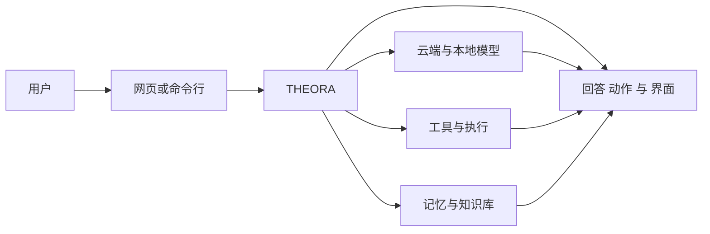
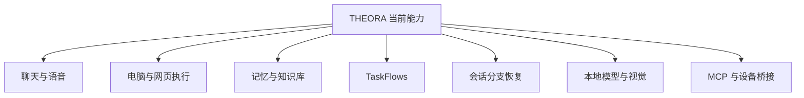
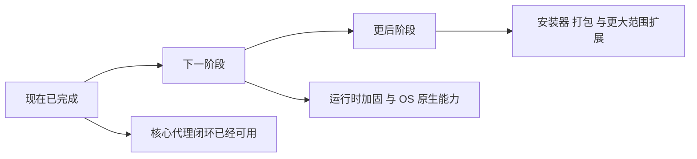

# THEORA 一页纸

> THEORA 是一个本地优先的 AI 代理平台。它不只是会聊天，而是可以理解、执行、记忆，并把软件与硬件能力连接在一起。

## 一句话说明

THEORA 已经不是一个概念演示，而是一个真正可运行的平台。它已经可以进行文字和语音对话、调用工具、长期记忆信息、执行可恢复的工作流、分支和恢复会话，并接入本地视觉模型。

## THEORA 是什么

可以把 THEORA 理解成一个“本地优先的智能代理操作层”。

它把下面这些能力放进同一个系统里：
- 文字和语音交互
- 电脑与网页操作
- 本地持久化记忆
- 可暂停可恢复的工作流
- 更丰富的界面输出
- 本地模型和云端模型
- 与设备、消息渠道、MCP 工具的连接能力

核心价值很简单：不是让 AI 只会回答问题，而是让它能够持续做事、记住事情、并在之后继续接着做。

## 我们已经做出来了什么

到目前为止，THEORA 的核心产品闭环已经基本成立：

- 文字聊天和实时语音已经打通。
- 电脑操作能力已经可用，支持命令、文件、搜索和网页信息获取。
- 系统已经具备本地记忆层，包括笔记、会话摘要和知识图谱。
- 这些记忆可以被整理成可浏览的 Memory Wiki。
- 代码仓库、PDF 和文本内容可以被导入到知识管线中。
- TaskFlows 可以在后台运行，也可以等待、恢复，并在重启后继续。
- 会话可以做快照、分支和恢复。
- 本地模型路径已经接入，并支持通过 Ollama 使用本地视觉模型。
- 前端界面已经不只是纯文本，而是可以展示卡片和结构化结果。

## 今天已经能做什么

| 能力模块 | 当前状态 | 简单理解 |
|:---------|:---------|:---------|
| 安装与配置 | 已具备 | 可以完成基础配置、身份设置和模型提供方选择。 |
| 聊天与语音 | 已具备 | 可以通过文字和实时语音与用户交互。 |
| 电脑操作 | 已具备 | 可以执行命令、读取文件、搜索代码和获取网页信息。 |
| 记忆与知识库 | 已具备 | 可以保存记忆、整理知识，并在之后再次浏览。 |
| 内容导入 | 已具备 | 可以把仓库、PDF、文本导入到记忆系统。 |
| TaskFlows | 已具备 | 可以运行可暂停、可恢复的后台工作流。 |
| 会话控制 | 已具备 | 可以安全地快照、分支、恢复对话。 |
| 本地视觉 | 已具备 | 可以通过本地 Ollama 视觉模型理解图像内容。 |
| 渠道与硬件 | 部分具备 | 相关接口和路径已经有了，但现场效果仍依赖配置、密钥和适配器。 |
| 受管浏览器运行时 | 尚未完成 | 这是下一阶段的重要工作。 |

## 为什么这件事重要

很多本地 AI 项目只停留在“能聊天”。THEORA 想解决的是更完整的问题。

- 它能记忆，所以工作不会每次从零开始。
- 它能跑工作流，所以任务不会因为会话结束就消失。
- 它支持会话分支和恢复，所以用户可以更安全地探索不同路径。
- 它支持本地模型，所以隐私和控制权更强。
- 它已经具备完整的平台故事，而不只是单点功能演示。

## 我们现在处在什么阶段

最重要的一点是：

THEORA 的核心平台能力已经成形。接下来的重点，不是重新发明产品，而是把已经存在的能力做得更稳定、更系统、更接近 OS 原生体验。

## 接下来做什么

下一阶段的重点，是把当前平台继续做强，而不是从头开始讲新故事。

下一波重点包括：
- 受管浏览器运行时
- Linux 权限层
- Linux 桌面节点与遥测能力
- 更稳定的原生语音 浏览器 与屏幕能力
- 在运行时基础稳定之后，再推进安装器和首次启动体验

## 最后的简单结论

今天的 THEORA，已经是一个可运行的本地优先 AI 代理平台，具备：
- 聊天
- 语音
- 电脑操作
- 记忆
- 知识整理
- 可恢复工作流
- 会话分支
- 本地视觉

这意味着项目已经越过“只是想法”的阶段。下一步要做的，是把它加固、产品化、并继续扩展。

## 链接

- 主仓库: [github.com/Spatial-AgenticOS/ASOS](https://github.com/Spatial-AgenticOS/ASOS)
- README: [../README.md](../README.md)
- 能力状态: [./SCORECARD.md](./SCORECARD.md)
- 路线图: [./ROADMAP.md](./ROADMAP.md)
