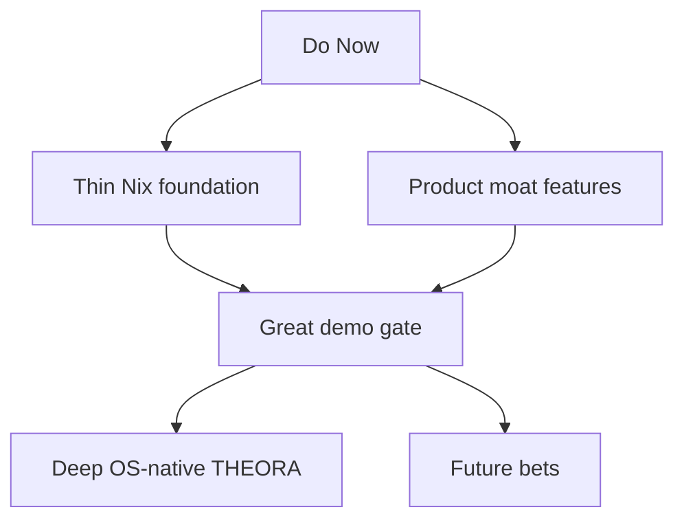

# THEORA Strategic Roadmap

This is the execution-ordered roadmap for THEORA. It keeps the full future vision visible, but it does not pretend everything should be built at once.

## Strategic Call

- Build against `NixOS minimal` as the primary OS-native path.
- Keep `Debian minimal` as the packaging and deployment fallback.
- Do not try to build the full THEORA OS first.
- Do build a thin Nix foundation now while shipping product-defining features in parallel.
- Plan the first great public demo after the `Do Now` bucket is complete enough to tell one coherent story.

## What "Right Now" Means

Right now, the correct move is to invest in the overlap between:

- features that make THEORA feel meaningfully stronger than a local chatbot
- infrastructure that makes a future NixOS-native THEORA realistic
- demo-worthy product surfaces that people can immediately understand

That means the near-term work is not "all OS" and not "all feature candy." It is the smallest set of foundations and product bets that compound into both.

## Priority Map

## Do Now

These are the highest-leverage items for the next serious execution window.

- `Thin Nix foundation` `(medium, must do now)`: create the first reproducible packaging layer, flake outputs, and a deterministic runtime mode so THEORA can be built and run cleanly without hidden host assumptions.
- `Packaging and config hygiene` `(medium, must do now)`: remove hardcoded ports, localhost assumptions, undeclared dependencies, and fuzzy state-path behavior.
- `Memory-wiki v1` `(medium, must do now)`: turn durable memory into a browsable markdown knowledge surface with provenance, not just embeddings and vibes.
- `TaskFlows` `(medium-hard, must do now)`: add durable long-running workflow state so jobs can survive pauses, waiting states, and resume cleanly.
- `Session branch and restore` `(medium-hard, must do now)`: let users branch a session, explore, and restore a prior state without losing the main thread.
- `Local model and vision expansion` `(medium, do now)`: prioritize a small number of strong additions such as `Ollama vision`, `Gemma 4` paths, and selective provider support where it improves the actual product.

### Why these go first

- They improve THEORA as a product immediately.
- They make the later NixOS-native move less risky.
- They create a much stronger demo than "we have a big OS idea."
- They increase differentiation against generic local agents.

### Concrete near-term outputs

- One flake that can build the core stack.
- One deterministic dev shell and local run path.
- One memory-wiki path that compiles durable notes into readable knowledge artifacts.
- One TaskFlow substrate for background or resumable work.
- One session branch and restore flow that users can actually feel.
- One polished local vision path instead of a giant provider matrix.

## Do In Parallel

These are worth doing now, but only as bounded side tracks.

- `graphify integration spike` `(medium, parallel)`: use it as a batch ingester for code, docs, PDFs, and research into THEORA's future wiki and knowledge graph layers. It belongs in the knowledge plane, not the OS foundation.
- `Capability scorecard` `(easy-medium, parallel)`: keep a simple parity sheet for voice, browser, computer use, memory, workflows, and local models so priorities stay honest.
- `Demo asset collection` `(easy, parallel)`: capture examples, artifacts, and user-facing screenshots as features land so demo planning is faster later.
- `Provider and channel cards in GenUI` `(medium, parallel)`: make the installed-provider story visible in the interface, but do not let this block memory or workflow foundations.

### Graphify position

`graphify` is useful, but it is not step one.

- Good use: source ingestion, graph extraction, wiki seeding, provenance-rich knowledge compilation.
- Bad use: making it the foundation of Nix packaging or the core runtime before THEORA's own memory-wiki contract exists.

## Do Next

These are the right next wave once the `Do Now` bucket is landed or clearly underway.

Execution order and gates for this wave are defined in [`docs/NEXT_WAVE_EXECUTION.md`](NEXT_WAVE_EXECUTION.md).

- `Linux desktop node and telemetry plane` `(hard, next)`: make the Linux host a first-class THEORA node for battery, network, BLE, audio, notifications, screens, and active app state.
- `Permission plane` `(hard, next)`: add Linux-native approval and permission handling for screen, mic, camera, browser control, and dangerous actions.
- `Managed browser runtime` `(hard, next)`: stop relying on "user started Chrome the right way" and promote browser automation into a supervised runtime.
- `Linux voice, browser, and screen hardening` `(hard, next)`: move from generic Linux assumptions to Wayland, PipeWire, and portal-aware behavior.
- `GenUI shell host` `(hard, next)`: evolve the current web and desktop surfaces into a launcher, quick-action, notification, and provider shell.
- `Provider and channel plane` `(medium-hard, next)`: make local models, channels, and provider bundles feel installable and manageable as product capabilities.
- `Infer-style workbench` `(medium-hard, next)`: build an inference and reasoning surface only after workflow state, memory, and session branching exist, because that is what will make it actually useful.

## Do Later

These matter, but they should not steal focus from the current leverage.

- `Installer ISO and first-boot experience` `(very hard, later)`: the real THEORA OS install path comes after the service graph and desktop node are stable.
- `Rollback and recovery productization` `(hard, later)`: prove recovery, rollback, safe mode, and rebuild behavior once the NixOS service graph is real.
- `Media creation and editing` `(hard, later)`: music and video generation or editing is valuable, but it opens a large rendering, storage, sandbox, and UX surface.
- `Large channel expansion` `(hard, later)`: add broad messaging platform coverage after the core workflow and install story are stronger.
- `Appliance and hardware profiles` `(hard, later)`: build special device SKUs and appliance-style images after the workstation path is stable.
- `Deep THEORA OS identity layer` `(very hard, later)`: installer branding, first-boot persona onboarding, policy profiles, and recovery UX belong after the platform foundations exist.

## Do Not Touch Yet

These are tempting but wrong to prioritize now.

- `A custom Linux distro fork` before the Nix foundation and module graph exist.
- `A custom compositor or desktop environment` before the shell host is proven.
- `A huge provider matrix` before a few local and hybrid paths are excellent.
- `A huge channel matrix` before TaskFlows, memory-wiki, and branching make the agent durable.
- `Advanced media pipelines` before the core product loop is stable.
- `Broad hardware support promises` before the Linux desktop node abstraction is real.

## Demo Timing

The right time to plan the great demo is after the `Do Now` track is substantially complete, not before.

That is the first point where the story becomes clear:

- install is cleaner and more reproducible
- THEORA has a believable Nix-native path
- memory feels durable and inspectable
- workflows can survive pauses and resume
- users can branch and restore sessions
- local model and vision capability looks real
- GenUI has visible product surfaces instead of only backend claims

### Minimum demo story

The first great demo should show one connected story:

1. Install or enable THEORA with a clean setup flow.
2. Create identity and provider choices.
3. Talk to THEORA with voice or text.
4. Use browser or computer actions.
5. Ingest a repo, doc set, or PDF into memory-wiki.
6. Launch a long-running TaskFlow that pauses and resumes.
7. Branch a session, test an alternative path, then restore.
8. Surface the result through GenUI cards with a local-model or vision-assisted step.

If those beats are real, the demo will feel like a platform. If they are not real, the demo will feel like a pitch.

## Execution Starts In These Files

The first implementation wave should begin in:

- `asos-core/pyproject.toml`: dependency truth and reproducible packaging.
- `asos-core/api/server.py`: service boot, port behavior, runtime contracts.
- `asos-core/config/loader.py`: config, state, and XDG-aware path rules.
- `asos-client/src/config.js`: deployment assumptions and same-origin strategy.
- `asos-core/agents/llm_provider.py`: local model and provider management.
- `asos-core/skills/impl/browser_use.py`: managed browser runtime assumptions.
- `asos-core/skills/impl/screen_capture.py`: Wayland and portal-aware capture path.
- `asos-core/memory/`: memory-wiki and durable knowledge surfaces.
- `asos-core/security/`: approvals, dangerous tools, and future Linux permission bridging.

## Final Call

The right move is:

- do the thin Nix foundation now
- do memory-wiki, TaskFlows, branching, and local vision now
- use `graphify` as a knowledge-plane accelerator, not a foundation
- push deep OS-native THEORA work into the next major wave
- plan the great demo immediately after the first wave is real enough to stand on its own

That keeps the entire future vision alive without letting the roadmap turn into a giant pile of simultaneous ambition.
