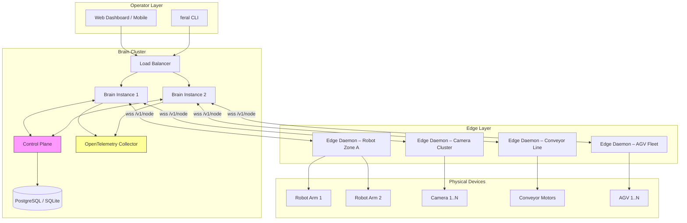

# FERAL at Scale: Warehouse and Business Control

> Engineering specification for evolving FERAL from single-brain home automation
> to multi-tenant, fleet-scale warehouse and business deployments.

## 1. Problem Statement

FERAL today assumes a single Brain serving a small set of daemons (phone, wristband,
glasses, a handful of home actuators). A warehouse or business deployment changes
every assumption:

- **Hundreds of devices** (cameras, conveyors, robot arms, scanners, AGVs)
- **Multiple operators** with different permission scopes
- **Hard real-time safety constraints** that cannot depend on LLM latency
- **Audit and compliance** requirements (who commanded what, when, why)
- **24/7 uptime** with graceful degradation when any single node fails

This spec defines the concrete subsystems required to close that gap without
rewriting the existing `CommandEnvelope` / `HardwareMesh` / `DeviceManifest`
contracts. Every section references the current codebase module it extends.

---

## 2. Fleet Registry

### 2.1 Per-Device Identity

Every physical device receives a stable identity tuple:

| Field | Type | Source |
|:------|:-----|:-------|
| `device_id` | UUID v4 | Assigned at provisioning, never rotated |
| `site_id` | string | Logical site (e.g. `warehouse-east`) |
| `zone_id` | string | Physical zone within a site (e.g. `aisle-7`) |
| `cert_fingerprint` | SHA-256 | Derived from the device's mTLS client cert |
| `firmware_version` | semver | Reported in `node_register` payload |
| `capabilities_hash` | SHA-256 | Hash of the sorted capability ID list |

Extends `DeviceManifest` in `hardware/protocol.py` with `site_id`, `zone_id`,
`cert_fingerprint`, and `firmware_version` fields.

### 2.2 Certificate Lifecycle

```
Provisioning CA ──signs──▶ Device Cert (365-day TTL)
                ──signs──▶ Brain Cert  (365-day TTL)
```

- Daemons present client certs on WebSocket upgrade (`wss:///v1/node`).
- The Brain validates the cert chain and extracts `device_id` from the CN.
- Cert renewal is automated via ACME or a local step-ca instance.
- Revocation uses a CRL distributed to every Brain instance on a 5-minute poll.

### 2.3 Firmware Versioning

The Brain maintains a `firmware_policy` table:

```sql
CREATE TABLE firmware_policy (
    device_type   TEXT NOT NULL,
    min_version   TEXT NOT NULL,   -- semver floor
    target_version TEXT NOT NULL,  -- desired version
    block_below   TEXT,            -- hard reject if below
    updated_at    REAL NOT NULL
);
```

On `node_register`, the Brain compares the reported `firmware_version` against
the policy. Devices below `block_below` are rejected. Devices below
`target_version` are flagged for OTA update and enter a `pending_update` state
in the registry.

### 2.4 Capability Negotiation

After registration, the Brain and daemon perform a capability handshake:

1. Daemon sends its `DeviceManifest` (including `capabilities` list).
2. Brain responds with an `accepted_capabilities` subset — capabilities that
   the current site policy permits.
3. Daemon acknowledges and discards tools not in the accepted set.

This prevents a compromised daemon from advertising capabilities it should
not expose (e.g., a conveyor daemon claiming `robot_move`).

---

## 3. Command Translation Layer

The existing flow (LLM selects a tool → `CommandEnvelope` → daemon) is
insufficient for warehouse scale. A high-level human intent must pass through
a deterministic pipeline before reaching any actuator.

### 3.1 Pipeline Stages

```
Human Intent
  │
  ▼
┌─────────────────────┐
│ 1. Intent Parser     │  NL → structured goal (e.g. "move pallet A to zone 3")
└──────────┬──────────┘
           ▼
┌─────────────────────┐
│ 2. Plan Generator    │  goal → ordered list of typed ExecutionStep objects
└──────────┬──────────┘
           ▼
┌─────────────────────┐
│ 3. Validator         │  check preconditions, zone permissions, device health
└──────────┬──────────┘
           ▼
┌─────────────────────┐
│ 4. Simulator         │  dry-run: predict outcomes, detect collisions, estimate time
└──────────┬──────────┘
           ▼
┌─────────────────────┐
│ 5. Executor          │  emit CommandEnvelope per step, monitor state machine
└─────────────────────┘
```

### 3.2 ExecutionStep Schema

```python
class ExecutionStep(BaseModel):
    step_id: str
    device_id: str
    action: str
    params: dict
    preconditions: list[Precondition]   # must all be true before dispatch
    postconditions: list[Postcondition] # asserted after SUCCEEDED
    timeout_s: float = 30.0
    rollback_action: str | None = None  # action to undo this step on plan failure
```

### 3.3 Dry-Run Mode

Any plan can be executed with `mode="dry_run"`. The simulator evaluates
preconditions, estimates durations, and returns a `PlanReport` without
dispatching any `CommandEnvelope`. The report includes:

- Predicted total duration
- Per-step feasibility verdict
- Collision or contention warnings (two plans targeting the same device)
- Estimated energy cost

The operator reviews the report and promotes to `mode="live"` if acceptable.

---

## 4. Multi-Camera Ingestion

### 4.1 Sampling Strategies

Not every frame needs VLM analysis. The ingestion pipeline supports:

| Strategy | Description | Use Case |
|:---------|:------------|:---------|
| `fixed_interval` | 1 frame every N seconds | Ambient monitoring |
| `motion_triggered` | frame on pixel-diff threshold | Intruder / anomaly |
| `event_gated` | frame when a command is in RUNNING state | Verify actuator result |
| `on_demand` | operator requests a snapshot | Manual inspection |

### 4.2 Time Synchronization

All cameras must report timestamps in UTC with NTP sync. The Brain rejects
frames with `abs(frame_ts - server_ts) > 5s` and flags the camera for
clock drift remediation.

### 4.3 ROI Policies

A `CameraROI` config maps camera `device_id` → list of polygon regions.
Only pixels within an ROI are forwarded to the VLM. This reduces token cost
and prevents the model from hallucinating about irrelevant background.

```yaml
camera_rois:
  cam-aisle-7:
    - name: conveyor_belt
      polygon: [[0,200],[640,200],[640,480],[0,480]]
      alert_classes: [person_in_zone, package_fallen]
    - name: loading_dock
      polygon: [[0,0],[320,0],[320,200],[0,200]]
      alert_classes: [door_open_too_long]
```

### 4.4 Alert Pipeline

```
Frame → ROI Crop → Edge Classifier (YOLO/RT-DETR on-device)
  │                        │
  │  confidence < threshold │  confidence ≥ threshold
  │          ▼              ▼
  │       discard      Alert Envelope → Brain ProactiveEngine
  │                        │
  │                  ┌─────┴─────┐
  │                  ▼           ▼
  │            CRITICAL      SUGGESTION
  │          (e-stop zone)  (anomaly log)
```

### 4.5 Storage Tiers

| Tier | Retention | Content |
|:-----|:----------|:--------|
| Hot | 24 hours | Full-res frames from alert events |
| Warm | 30 days | Keyframes (1/min) + all alert metadata |
| Cold | 1 year | Alert metadata only, frames in object storage |

Tier promotion/demotion runs as a background cron in the Brain's `CronService`.

---

## 5. Robot Safety

### 5.1 Design Principle

**Safety logic executes on the edge daemon, not in the Brain or the LLM.**

The Brain may request `robot_move(speed=80)`, but the daemon's local safety
governor clamps it to `speed=min(80, zone_max_speed)` before actuating.
The LLM never has direct wire access to a motor controller.

### 5.2 E-Stop Semantics

| Trigger | Scope | Recovery |
|:--------|:------|:---------|
| Hardware button | Single device | Physical reset required |
| Software e-stop (`priority="safety"` + `action="e_stop"`) | Single device or zone | Operator `resume` command after inspection |
| Zone breach (human enters robot workspace) | All devices in zone | Automatic resume after zone clears for >10s |
| Heartbeat loss (Brain → daemon) | Single device | Device enters safe-stop; resumes on reconnect |

E-stop commands bypass the normal priority queue and execute immediately
on the daemon's safety interrupt handler.

### 5.3 Workspace Bounds

Every robot daemon loads a `workspace.json` at startup:

```json
{
  "bounds_mm": {"x": [-500, 500], "y": [-500, 500], "z": [0, 800]},
  "max_speed_mm_s": 200,
  "max_acceleration_mm_s2": 500,
  "restricted_zones": [
    {"name": "human_corridor", "polygon_mm": [[100,200],[300,200],[300,400],[100,400]], "max_speed_mm_s": 50}
  ]
}
```

The daemon's motion planner rejects any trajectory that exits `bounds_mm`
or exceeds speed limits. This check is pure math — no network call, no LLM.

### 5.4 Human-in-the-Loop Gates

Capabilities with `permission_tier="dangerous"` in the `DeviceManifest`
require explicit operator confirmation. The Brain emits an SDUI approval
card; the daemon holds the `CommandEnvelope` in `ACKED` state until the
approval callback arrives or the deadline expires.

---

## 6. Failure Isolation

### 6.1 Per-Node Circuit Breakers

Extends `NodeHealth` in `hardware/command_contract.py`:

```python
class CircuitBreaker:
    states: CLOSED | HALF_OPEN | OPEN
    failure_threshold: int = 5        # consecutive failures to trip
    recovery_timeout_s: float = 30.0  # time in OPEN before probing
    half_open_max: int = 1            # probes allowed in HALF_OPEN
```

When a node's breaker is OPEN, the `HardwareMesh.invoke()` call returns
immediately with `{"success": false, "error": "circuit_open"}` without
sending any WebSocket frame.

### 6.2 Backpressure

Each daemon connection maintains an outbound queue. If the queue depth
exceeds `max_pending_commands` (default 32), new `CommandEnvelope`s for
that node are rejected with `BACKPRESSURE` and the caller retries with
exponential backoff.

### 6.3 Priority Queues

The existing `priority` field on `CommandEnvelope` (`safety > interactive >
background`) is enforced at the Brain's dispatch layer:

1. **Safety queue**: unbounded, preempts all others, wakes the dispatch loop.
2. **Interactive queue**: bounded (64), serves operator commands.
3. **Background queue**: bounded (256), serves telemetry requests, OTA, analytics.

Starvation protection: background commands that have waited >60s are promoted
to interactive priority.

---

## 7. Multi-Tenant Architecture

### 7.1 Project / Workspace Isolation

Each tenant operates within a `Workspace`:

```python
class Workspace(BaseModel):
    workspace_id: str           # UUID
    name: str
    owner_id: str               # tenant admin
    site_ids: list[str]         # sites this workspace can access
    device_filter: str          # glob on device_id (e.g. "warehouse-east/*")
    llm_budget_tokens: int      # monthly token cap
    storage_quota_gb: float
```

The Brain's `BrainState` holds a `workspace_id` context for every active
session. All queries to `MemoryStore`, `CommandLedger`, and `DeviceRegistry`
are scoped by `workspace_id`.

### 7.2 RBAC

| Role | Permissions |
|:-----|:------------|
| `viewer` | Read telemetry, view dashboards |
| `operator` | Issue interactive commands, approve dangerous actions |
| `admin` | Manage devices, firmware policies, workspace settings |
| `super_admin` | Cross-workspace access, tenant provisioning |

Roles are stored in a `workspace_roles` table and enforced by middleware
on every API route and WebSocket message handler.

### 7.3 Audit Trail

Every `CommandEnvelope` records `initiated_by` (user ID or `system`).
The `CommandLedger` stores the full state history. An `audit_events` table
captures non-command events (login, config change, firmware update):

```sql
CREATE TABLE audit_events (
    event_id      TEXT PRIMARY KEY,
    workspace_id  TEXT NOT NULL,
    actor_id      TEXT NOT NULL,
    event_type    TEXT NOT NULL,
    resource_type TEXT,
    resource_id   TEXT,
    details_json  TEXT,
    ts            REAL NOT NULL
);
CREATE INDEX idx_audit_ws_ts ON audit_events(workspace_id, ts DESC);
```

---

## 8. Observability

### 8.1 OpenTelemetry Integration

Every `CommandEnvelope` carries a `correlation_id` that becomes the
OTel trace ID. The trace spans the full lifecycle:

```
[Brain Orchestrator]
  └─ span: plan_generation (command_id, correlation_id)
      └─ span: validation
      └─ span: dispatch_to_daemon (node_id)
          └─ span: daemon_execution (on edge, reported via telemetry)
              └─ span: actuator_driver (motor controller, GPIO, etc.)
```

### 8.2 Metrics Export

Key metrics exported via Prometheus-compatible `/metrics` endpoint:

| Metric | Type | Labels |
|:-------|:-----|:-------|
| `feral_commands_total` | counter | `node_id`, `action`, `state` |
| `feral_command_latency_seconds` | histogram | `node_id`, `action` |
| `feral_node_health` | gauge | `node_id`, `healthy` |
| `feral_circuit_breaker_state` | gauge | `node_id`, `state` |
| `feral_camera_frames_processed` | counter | `camera_id`, `strategy` |
| `feral_llm_tokens_used` | counter | `workspace_id`, `model` |

### 8.3 Structured Logging

All log lines are JSON-formatted with `command_id`, `correlation_id`,
`workspace_id`, and `node_id` fields. Log aggregation (Loki, ELK) can
reconstruct the full causal chain for any incident.

---

## 9. Reconciliation: Desired-State vs Actual-State

### 9.1 State Model

The Brain maintains a `DesiredState` document per device:

```python
class DesiredState(BaseModel):
    device_id: str
    properties: dict        # e.g. {"conveyor_speed": 1.5, "light": "on"}
    version: int            # monotonic, incremented on every mutation
    updated_at: float
```

Daemons periodically report `ActualState` via telemetry. The reconciliation
loop runs every `reconcile_interval_s` (default 10):

```
for device in registry.all_devices():
    desired = desired_state_store.get(device.device_id)
    actual  = latest_telemetry(device.device_id)
    drift   = diff(desired.properties, actual)
    if drift:
        if drift.age > alert_threshold_s:
            emit_alert(DriftAlert(device_id, drift))
        if drift.auto_correct:
            enqueue_correction_commands(device_id, drift)
```

### 9.2 Drift Alerting

Drift alerts flow into the `ProactiveEngine` as `IMPORTANT` priority
messages. Operators see an SDUI card with the delta and can approve
auto-correction or investigate manually.

---

## 10. Architecture Diagram



### Component Responsibilities

| Component | Role |
|:----------|:-----|
| **Brain Instance** | Hosts `Orchestrator`, `HardwareMesh`, `CommandLedger`, `ProactiveEngine`. Stateless except for session affinity. |
| **Control Plane** | Workspace/tenant metadata, firmware policies, RBAC, desired-state store. Shared across Brain instances. |
| **Edge Daemon** | Local safety governor, command execution, telemetry collection, circuit breaker, e-stop handler. |
| **OTel Collector** | Aggregates traces and metrics from all Brain instances and edge daemons. |

---

## 11. Migration Path from Single-Brain

| Phase | Scope | Key Deliverable |
|:------|:------|:----------------|
| **0 — Today** | Single Brain, `~/.feral/` SQLite | Current codebase |
| **1 — Fleet Identity** | mTLS certs, firmware policy table, capability negotiation | `hardware/fleet_registry.py` |
| **2 — Command Pipeline** | ExecutionStep, Validator, Simulator, dry-run | `agents/command_pipeline.py` |
| **3 — Safety Edge** | Workspace bounds, e-stop daemon handler, circuit breakers | Daemon-side `safety_governor` module |
| **4 — Multi-Camera** | Sampling strategies, ROI, alert pipeline, storage tiers | `perception/camera_fleet.py` |
| **5 — Multi-Tenant** | Workspace model, RBAC middleware, audit table | `api/middleware/tenant.py` |
| **6 — Observability** | OTel spans on CommandEnvelope, Prometheus metrics | `observability/` package |
| **7 — Reconciliation** | Desired-state store, drift loop, auto-correction | `agents/reconciler.py` |
| **8 — HA Brain** | Multiple Brain instances behind LB, shared Control Plane DB | Deployment config (Kubernetes / NixOS) |

Each phase is independently shippable and backward-compatible with the
existing single-brain deployment.

---

## 12. Open Questions

1. **Edge compute budget**: Should edge daemons run lightweight ML models
   (e.g., YOLO-NAS-S) for local classification, or stream raw frames?
2. **State store**: PostgreSQL for the Control Plane, or CockroachDB for
   multi-region?
3. **Inter-Brain communication**: gRPC vs NATS vs the existing WebSocket
   protocol extended with Brain-to-Brain hops?
4. **OTA orchestration**: Rolling update with canary (10% of devices first)
   or blue/green per zone?
