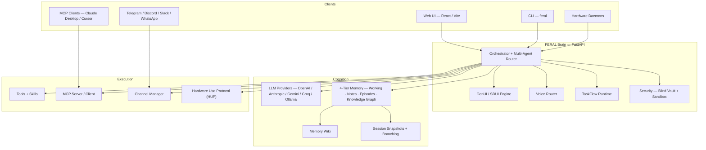

# Architecture

FERAL is structured as a layered system. The **Brain** is the central runtime — a FastAPI Python server that orchestrates reasoning, memory, tools, voice, hardware, and UI generation. Clients (web, CLI, hardware daemons, messaging channels) connect over HTTP and WebSocket.

## System Diagram



## Core Layers

### Reasoning Plane

The **Orchestrator** (`feral-core/agents/orchestrator.py`) runs the main agent loop:

1. Receive user intent (text, voice, or hardware event).
2. Load context: memory tiers, identity, session state.
3. Route to an LLM provider via the multi-provider interface.
4. Execute tools selected by the LLM.
5. Store results in memory, update the knowledge graph.
6. Return response — optionally as GenUI SDUI payload.

The **Multi-Agent Router** can dispatch to specialist workers (health, home, research, creative) based on intent classification and learned routing preferences.

### Memory Plane

| Tier | Storage | Lifecycle |
|:-----|:--------|:----------|
| **Working Memory** | RAM | Per-session; cleared on session end |
| **Notes** | SQLite + FTS | Persistent; user-created via "remember X" |
| **Episodes** | SQLite + FTS | Auto-generated conversation summaries |
| **Knowledge Graph** | SQLite (S-P-O triples) | Extracted facts and relationships |

On top of these tiers:

- **Memory Wiki** — compiles notes, episodes, and graph entries into durable wiki pages with provenance tracking.
- **Session Snapshots** — snapshot, branch, and restore full conversation + working memory state.

All data is stored locally in `~/.feral/memory.db`.

### Workflow Plane

**TaskFlows** (`feral-core/agents/taskflow.py`) are durable background workflows backed by SQLite:

- Persist through restarts.
- Support `wait` (pause until a condition), `resume`, and `cancel`.
- Each flow tracks a step timeline with status transitions.
- API: `POST /api/taskflows`, `GET /api/taskflows/{id}`, `POST /api/taskflows/{id}/resume`.

### Interface Plane (GenUI)

The GenUI engine generates **Server-Driven UI** payloads from tool results and provider contracts:

1. A tool returns structured data.
2. The GenUI engine selects an appropriate SDUI template (card, chart, map, form, list).
3. The payload is sent to the client, which renders it without knowing the tool's internals.

For provider surfaces, a JSON contract defines layout, brand tokens, and endpoints. FERAL compiles the surface once, caches it, and reuses the fixed layout on subsequent opens.

### Execution Plane

- **Tools & Skills** — computer use (shell, files, grep), web search, browser automation, custom JSON manifests, Python plugins, WASM sandboxed skills.
- **MCP** — dual-role: expose FERAL's tools as an MCP server, and consume external MCP servers.
- **Channels** — bridge to Telegram, Discord, Slack, WhatsApp.
- **HUP (Hardware Use Protocol)** — devices connect via WebSocket, register with a declarative manifest, stream telemetry, and receive commands.

### Security

- **Blind Vault** — API keys stored encrypted, never exposed to the LLM.
- **WASM Sandbox** — untrusted skills run in a Wasmtime sandbox.
- **Permission Plane** — tool-level approval policies.

## Wire Protocol

All client↔brain communication uses the `FeralMessage` envelope defined in `feral-core/models/protocol.py`:

```json
{
  "type": "text_command | text_response | stream_delta | sdui_payload | telemetry | ...",
  "session_id": "abc-123",
  "payload": { }
}
```

WebSocket endpoints:

| Path | Purpose |
|:-----|:--------|
| `/v1/session` | Client sessions — chat, voice, UI events |
| `/v1/node` | Hardware daemon connections |
| `/sync` | Federated memory sync between nodes |

## Data Storage

| Path | Contents |
|:-----|:---------|
| `~/.feral/settings.json` | Feature flags, LLM provider, voice mode |
| `~/.feral/credentials.json` | API keys (chmod 600) |
| `~/.feral/USER.md` | User profile and identity |
| `~/.feral/SOUL.md` | Agent personality and rules |
| `~/.feral/memory.db` | Memory tiers + knowledge graph (SQLite) |
| `~/.feral/genui_surfaces/` | Cached compiled GenUI provider surfaces |
| `~/.feral/skills/` | User-installed skill manifests |
| `~/.feral/mcp_servers.json` | External MCP server connections |

## Tech Stack

| Layer | Technology |
|:------|:-----------|
| Brain | Python 3.11+, FastAPI, Uvicorn, Pydantic v2 |
| Storage | SQLite + FTS5 + optional sqlite-vec |
| LLM | OpenAI SDK, Anthropic, Google Generative AI, Groq, Ollama |
| Web UI | React 18, Vite 5, Tailwind CSS 4, React Router 7 |
| Desktop | Tauri 2 (Rust + React) |
| Hardware | WebSocket mesh, HUP protocol |
| Packaging | PyPI (`feral-ai`), npm (`@feral/sdk`), Nix flake, Docker Compose |
