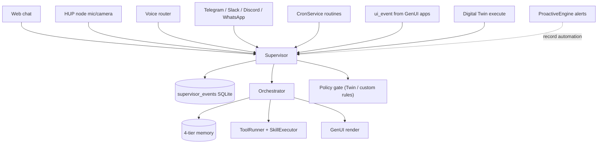
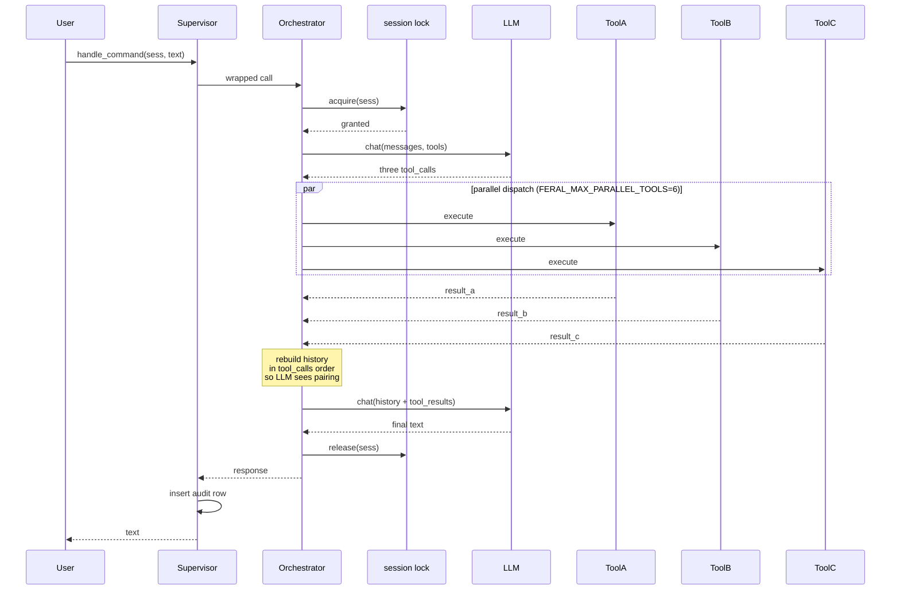
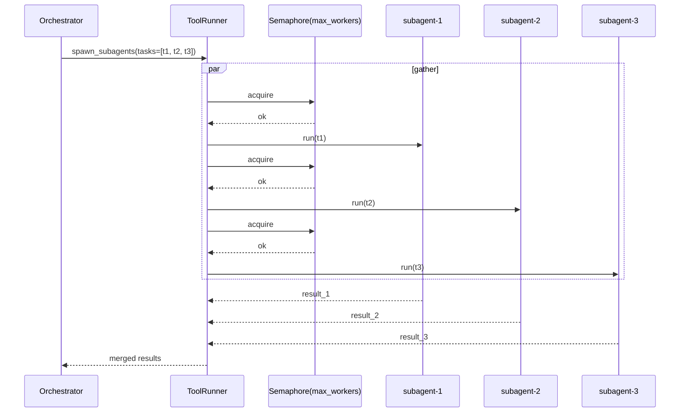

# Orchestration

How FERAL takes a request from anywhere (chat, voice, channel, HUP node,
proactive engine, cron, digital twin) and turns it into a response —
with audit, parallelism, and per-session safety.

## One seat over everything

Every entry point the user can reach goes through the `Supervisor` before
it touches the `Orchestrator`. The Supervisor is a thin wrapper that
records every call (source, kind, actor, decision, latency) into a
SQLite audit log and respects a global kill switch. Commit 2 of this
plan widened it to cover four orchestrator methods: `handle_command`,
`handle_command_stream`, `handle_ui_event`, and `handle_daemon_result`.

Source tagging is honest: cron-driven turns record `source="cron"`, the
proactive engine records `source="proactive"`, chat turns record
`source="web"`, HUP nodes record `source="node"`, and the twin records
`source="twin"`. You can filter the audit log by source at
`GET /api/supervisor/events?source=cron`.

## A single chat turn

Every call to `handle_command` now runs inside a **per-session async
lock**. Two concurrent turns on the same `session_id` queue — they
share `conversation_history` and the outgoing tool_call ordering, so
interleaving them would corrupt both. Turns across different sessions
run fully in parallel.

Before Stage 1 of this plan, the `for tc in tool_calls: await ...` loop
executed N tools in series — a single turn that needed
`web_search + weather + calendar + memory_query` took ~4x as long as
the slowest tool. Now it completes in `max(tool_i)` wall-clock, bounded
only by `FERAL_MAX_PARALLEL_TOOLS` (default 6). Set it to `1` to
restore strict sequential behaviour for debugging.

## Spawning subagents

The agent can still spin parallel subagents on demand via the
`subagent__spawn_subagent` tool. This path is older than the per-turn
parallel dispatch and uses its own `asyncio.gather` + `Semaphore` in
[`feral-core/agents/tool_runner.py`](../feral-core/agents/tool_runner.py).

Each subagent shares the parent's skill registry and memory, but
gets a scoped session id and a bounded iteration count so it cannot
loop forever.

## What that looks like in practice

- **Fast multi-tool turn.** "What's my weather, my next meeting, and did
  I have a note about that PR?" → three skills fire in parallel instead
  of sequentially.
- **Safe concurrent channels.** Telegram and Slack DMs arriving a second
  apart for the same user queue on the per-session lock. Different
  users on the same channel fan out fully.
- **Honest cron audit.** Scheduled morning briefings no longer impersonate
  a web-chat turn in the oversight log. Filter
  `/oversight?source=cron` to see every routine that fired.
- **Proactive automations in the log.** Every `set_scene` / breathing
  exercise / notification from `ProactiveEngine._execute_automation`
  lands as `source="proactive"` with `actor="system"`. If the kill
  switch flips, nothing fires.

## Further reading

- [feral-core/agents/orchestrator.py](../feral-core/agents/orchestrator.py) — the main loop. Look for `_handle_command_impl` + the `asyncio.gather` block around line 720.
- [feral-core/agents/supervisor.py](../feral-core/agents/supervisor.py) — `wrap`, `_wrap_call`, `record`. Four entry points listed explicitly.
- [feral-core/agents/tool_runner.py](../feral-core/agents/tool_runner.py) — subagent parallel execution with semaphore.
- [feral-core/api/routes/supervisor.py](../feral-core/api/routes/supervisor.py) — the `/oversight` REST surface.
- [docs/roadmap/oversight.md](roadmap/oversight.md) — what's next for the policy gate + retention + anomaly alerts.
